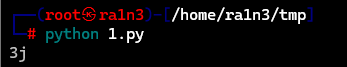
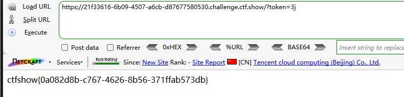

```
<?php

/*
# -*- coding: utf-8 -*-
# @Author: h1xa
# @Date:   2020-09-03 11:43:51
# @Last Modified by:   h1xa
# @Last Modified time: 2020-09-03 11:56:11
# @email: h1xa@ctfer.com
# @link: https://ctfer.com

*/
error_reporting(0);

include('flag.php');
if(isset($_GET['token'])){
    $token = md5($_GET['token']);
    if(substr($token, 1,1)===substr($token, 14,1) && substr($token, 14,1) ===substr($token, 17,1)){
        if((intval(substr($token, 1,1))+intval(substr($token, 14,1))+substr($token, 17,1))/substr($token, 1,1)===intval(substr($token, 31,1))){
            echo $flag;
        }
    }
}else{
    highlight_file(__FILE__);

}
?>

```

分析源码

GET提交token，并将其md5加密后重新存储在token中

条件：

token满足第二个字符等于第十五个字符

并且第十五个字符等于第十八个字符

第二个字符加第十五个字符加第十八个字符除以第二个字符的整数值等于等于第三十二个字符的整数值

满足条件则返回flag


python脚本

```
import hashlib
# 导入Pyhon的hashlib模块，用于计算MD5的值

dic='12345677890qwertyuiopasdfghjklzxcvbnm'
# 定义一个字符集，包括数字和字母，用于生成两位字符串
for i in dic:
    for j in dic:
        t=str(i)+str(j)
# 双重循环，用于生成可能存在的两位字符串

        md5=hashlib.md5(t.encode('UTF-8')).hexdigest()
# 对生成的字符串t进行MD5加密，用于生成32位十六进制字符串

        if md5[1] != md5[14] or md5[14]!=md5[17] :
		   continue
# 检查MD5的第二，第十五，第十八位是否相等，如果不相等，则跳过当前循环

        if(ord(md5[1]))>48 and ord(md5[1])<=57 and (ord(md5[31]))>=48 and  ord(md5[31])<=57:
# 确保第二位字符是数字（ASCII码48是‘0’，57是‘9’）
# 确保第三十二位是数字
          if((int(md5[1])+int(md5[14])+int(md5[17]))/int(md5[1])==int(md5[31])):
# 计算(第2位 + 第15位 + 第18位) / 第2位，并检查是否等于第三十二位的整数值。
                print(t)
```



构造payload

```
?token=3j
```

