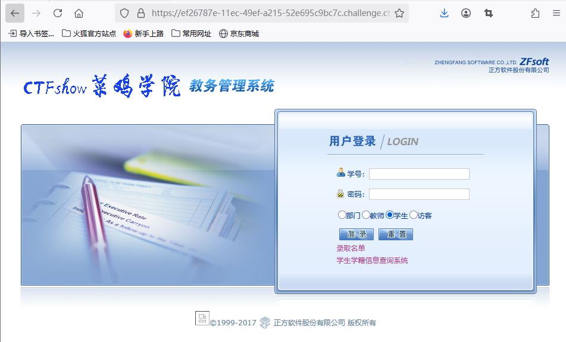
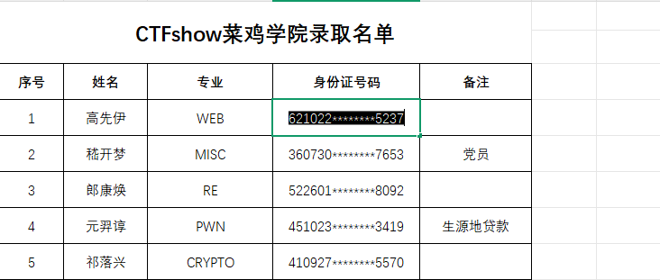
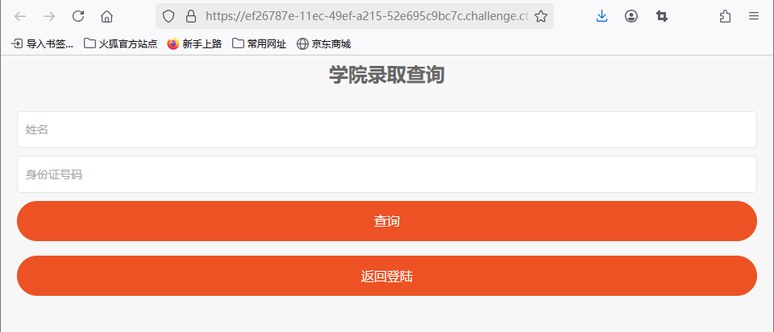
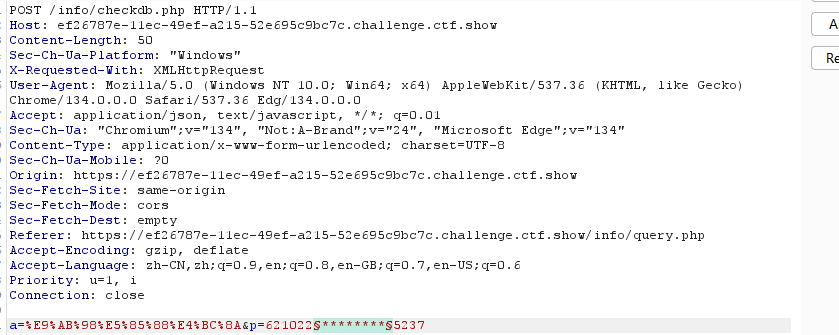
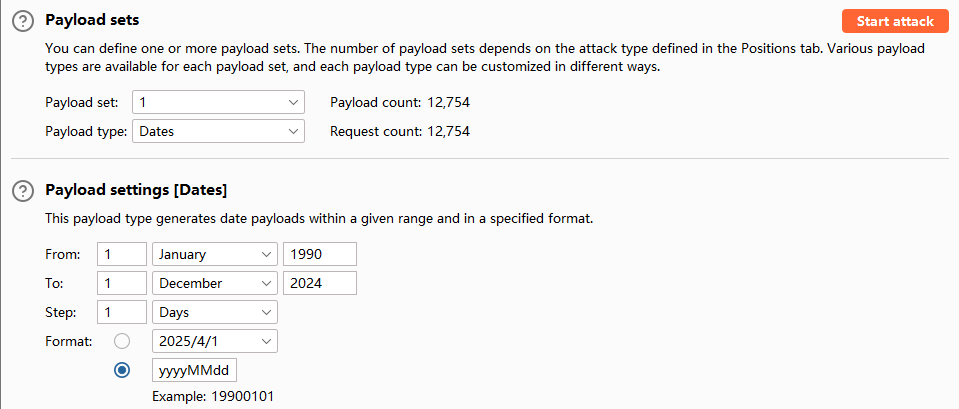
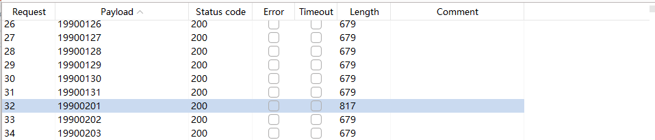
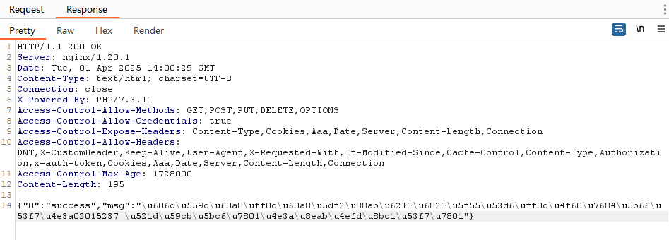
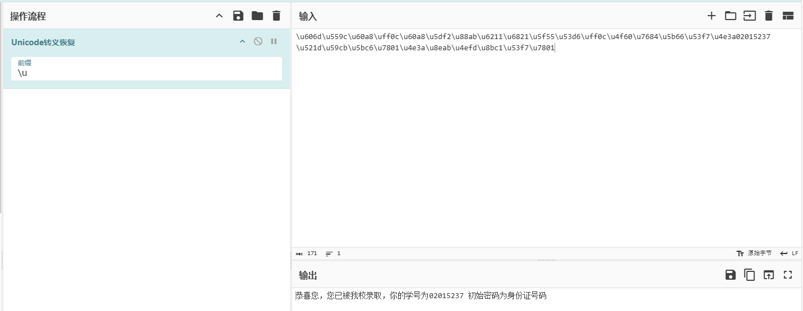
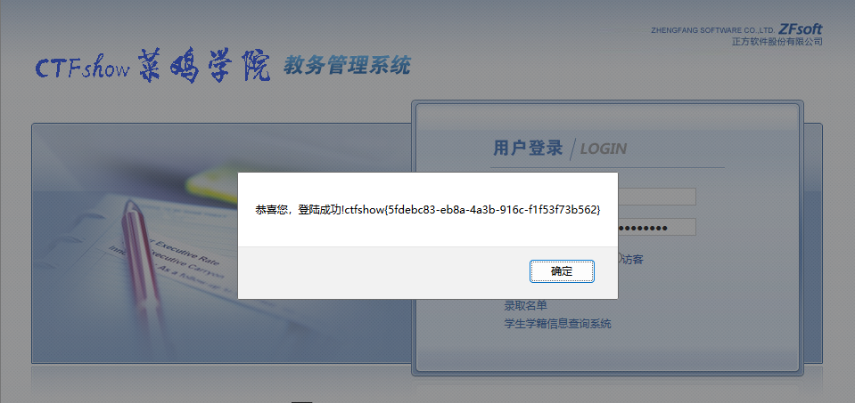

登录界面

源码无内容

存在录取名单

点击后会下载名单



身份证号存在加密

而学生学籍信息查询系统可以天姓名和身份证号



尝试在这里进行爆破身份证号码


bp抓包（这里火狐抓不到，我是用edge抓的包）

放入爆破模块

然后添加payload



设置payload格式

开始爆破

得到结果



查看返回包



```
\u606d\u559c\u60a8\uff0c\u60a8\u5df2\u88ab\u6211\u6821\u5f55\u53d6\uff0c\u4f60\u7684\u5b66\u53f7\u4e3a02015237 \u521d\u59cb\u5bc6\u7801\u4e3a\u8eab\u4efd\u8bc1\u53f7\u7801
```

Unicode解码



成功登录

