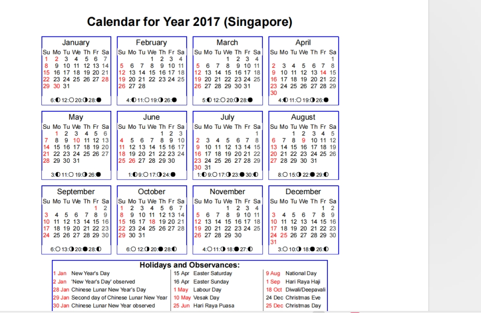
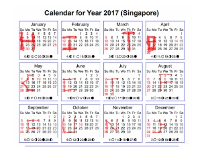

题目描述：

01081522291516170310172431-050607132027262728-0102030209162330-02091623020310090910172423-02010814222930-0605041118252627-0203040310172431-0102030108152229151617-04050604111825181920-0108152229303124171003-261912052028211407-04051213192625

 

 

 

 

01081522291516170310172431-

050607132027262728-

0102030209162330-

02091623020310090910172423-

02010814222930-

0605041118252627-

0203040310172431-

0102030108152229151617-

04050604111825181920-

0108152229303124171003-

261912052028211407-

04051213192625

 

将描述中的数字字符串按-分开

刚好十二组

数字对应日历中的数字

 

 

得到flag

 

 