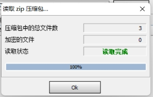
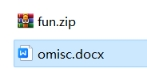
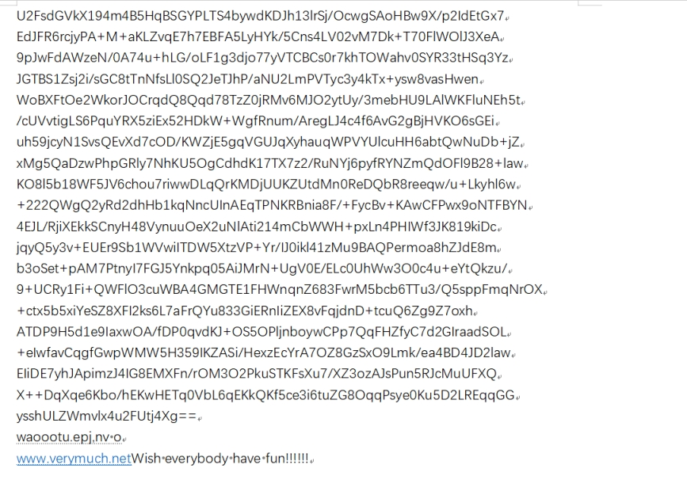
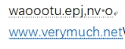
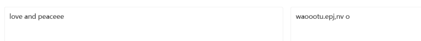
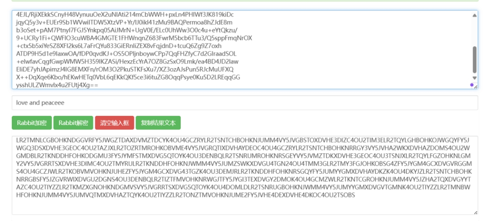
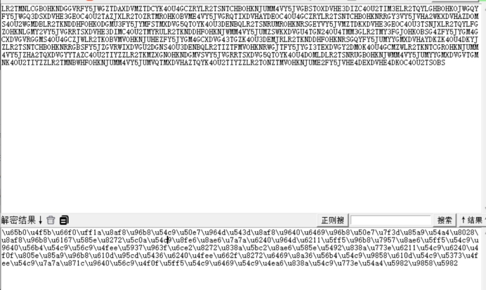
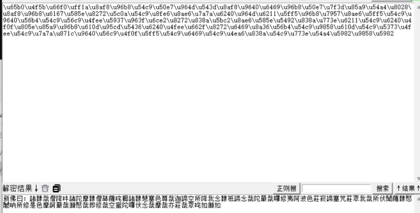

Zip文件

扫描发现是伪加密

 

 

 

修复后成功解压

 

打开文档

 

 

 

U2Fsd 开头 rabbit加密

同时尾部隐藏有文字

 

 

wp是 希尔密码

进行解密

[希尔在线加密解密 - 站长工具](https://tool.chinaz.com/tools/hill)

得到

 

解密 rabbit

[Rabbit加密-Rabbit解密-在线Rabbit加密解密工具](http://www.jsons.cn/rabbitencrypt/)

 

 

全是大写字母及数字

推测是base 32

解码

 

 

 

 

unicode编码

进行unicode转str

 

 

 

 