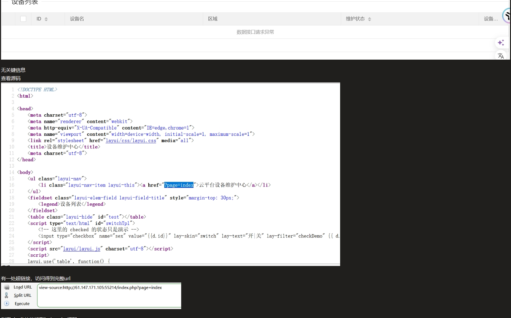
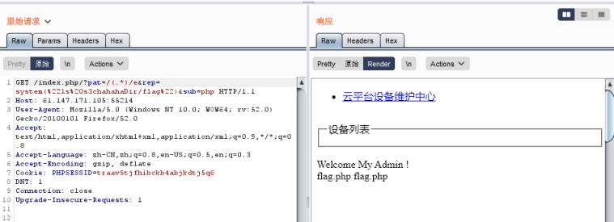

得到

 

路径

访问发现存在flag目录

 

访问flag

发现存在flag.php

 

读取

查看源码，得到flag

 

或者利用php伪协议读取文件

构造payload：

 

 

查看源码

/?page=php://filter/read=convert.base64-encode/

resource=s3chahahaDir/flag/flag.php

 

解码得到flag

 

 

 