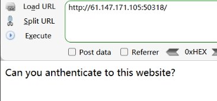
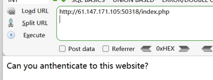
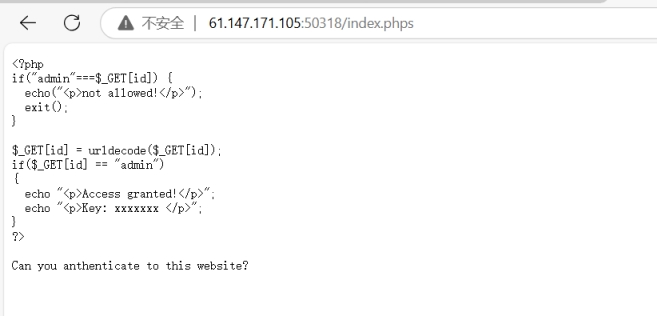
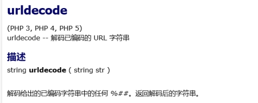
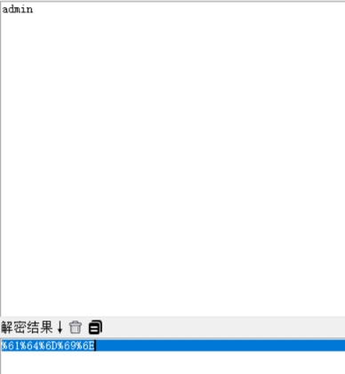
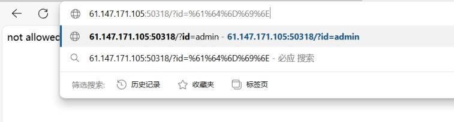
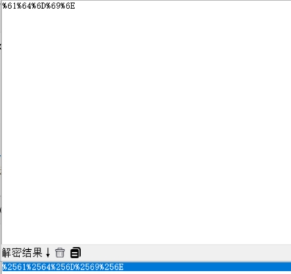
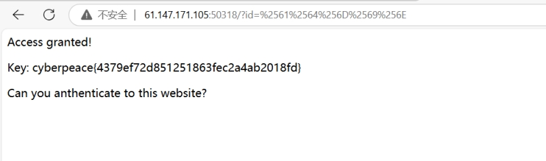

 

 

根据题目PHP2判断是php脚本

访问index.php

 

无变化

访问index.phps

 

得到源码

 

什么是 .phps呢？ 

phps 文件就是php的源代码文件，通常用于提供给用户（访问者）来查看php代码，因为用 户无法直接通过Web浏览器看到php文件的内容，所以需要用phps文件代替。其实，只要不用php等已经在服务器中注册过的MIME类型为文件即可，但为了国际通用，所以才用了phps文件类型。

 

 

分析源码

 

传参id

且传入id的值不能为"admin"，否则返回“not allowed！”

 

接着对传参id解析urldecode（即解码已编码的url字符串）

 

并判断解码后是不是为“admin”

将admin进行url编码

 

 

 

访问出错，地址栏对url自动解码

对admin进行二次url编码

 

 

 

得到flag

 

 