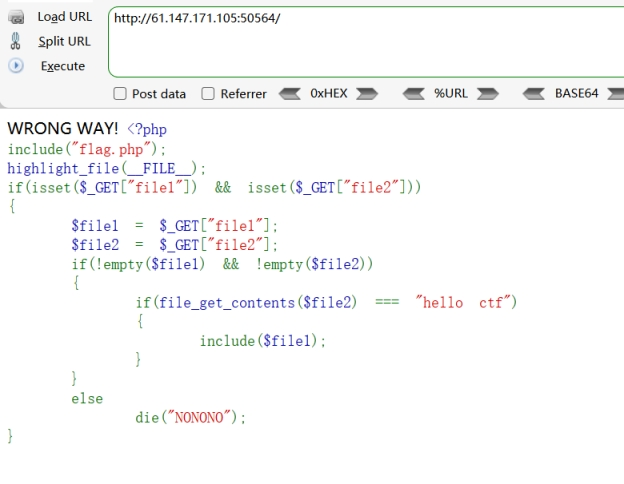
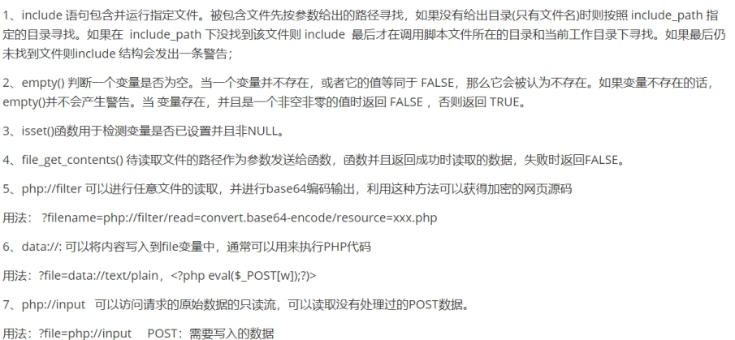
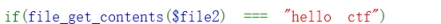
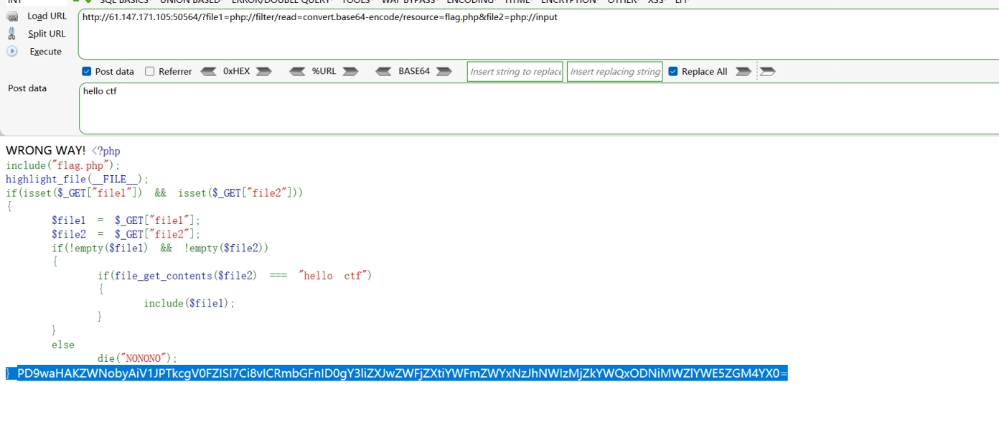
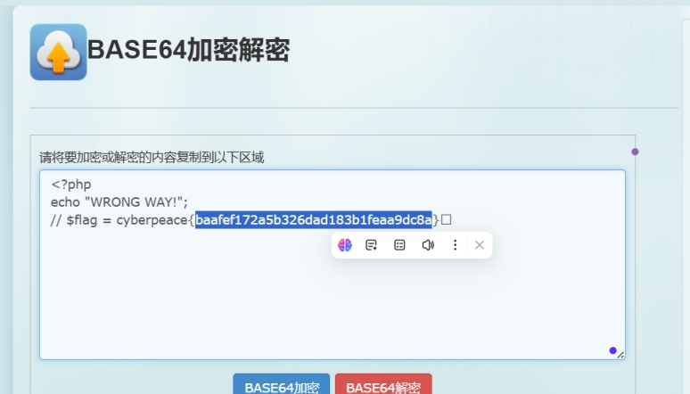

分析源码

 

 

 

 

 

构造payload：、

首先file1利用php伪协议读取flag.php内容

File1=php://filter/read=convert-base64-encode/resource=flag.php

 

利用php://input访问post数据

post写入 hello ctf

使其满足

 

 

 

解密得到flag

 

 

 