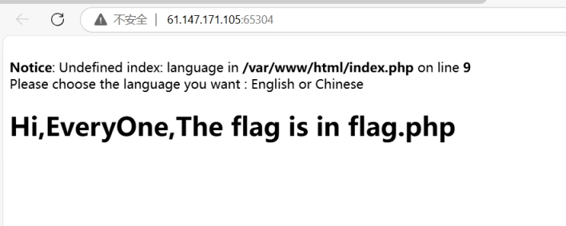
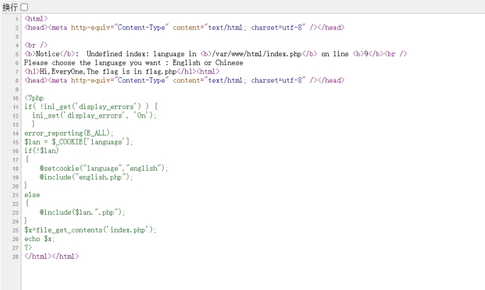
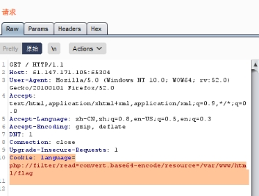

 

 

 

查看源码

出现了文件包含

审查后发现它检查是否设置了名为"language"的语言 cookie。如果未设置，则将该 cookie 设置为"english"并包含"english.php"文件。如果 cookie 已经设置，则包含基于 cookie 值的 PHP 文件。

最后，它读取"index.php"文件的内容并将其打印到输出中。

 

 

出现的漏洞:

如果将名为 language 的 cookie 设置为 php://filter/read=convert.base64-encode/resource=flag，那么在执行到代码中的以下行时：

$lan = $_COOKIE['language'];

代码会将该 cookie 的值作为 PHP 文件路径，并尝试读取该文件的内容，即：

readfile('php://filter/read=convert.base64-encode/resource=flag');

这里的 php://filter 是一种 PHP 内置的流筛选器，可以通过这个路径访问各种输入输出流（比如文件），并按照指定的一系列过滤器对其进行处理。

在这里，read=convert.base64-encode 意味着将文件内容进行 Base64 编码，从而使文件内容变成可读的字符串。而 resource=flag 指定了要读取的文件为名为 flag 的文件（这里假设存在这个文件）。

因此，在这种情况下，如果攻击者能够成功将 cookie 的值设置为 php://filter/read=convert.base64-encode/resource=flag，那么当代码执行到 $_COOKIE['language'] 这行时，将会读取(方式:php://filter) flag 文件的内容，并对其进行 Base64 编码后输出到页面上。

这种攻击方式称为 “PHP 命令注入”，并且它能够导致严重的安全问题，因此在编写代码时要进行必要的输入校验和过滤，以避免此类攻击。

burp抓包

修改cookie

 

放包发现出现base64编码

 

解码得到flag

 

 