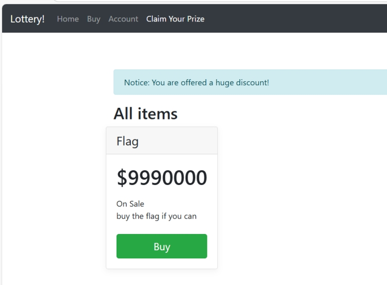
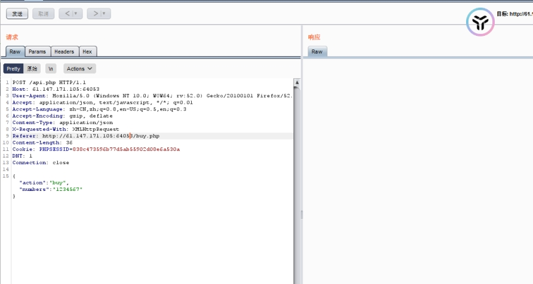

访问发现是一个彩票网站

 

Home

游戏规则：

 

 

Buy 买一张彩票

 

 

Account 当前账户金额

 

 

 

购买flag

 

 

 

 

dirsearch 扫描网站

发现存在git泄露

 

 

 

githack下载得到源码
 

 

 

 

 

 

 

访问api.php(这是接口文件一般是定义方法类的)

发现buf方法存在弱类型判断漏洞

 

这是获取代币的方法：

生成7个随机数并依次与传入的number比较，当为true时，$same_count记录的值加1

==弱类型比较绕过

 

 

bp抓包

 

 

将numbers改为数组：

"numbers":[true,true,true,true,true,true,true]

 

 

 

 

 