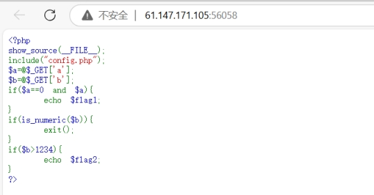
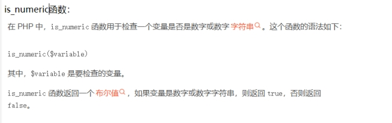
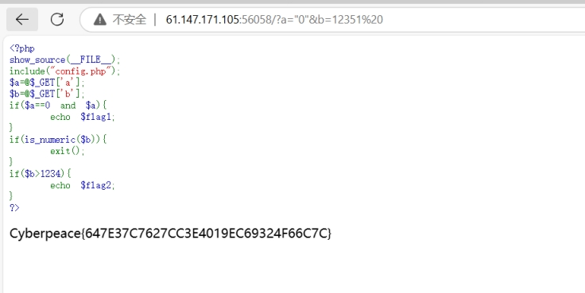

分析源码

get提交两个参数

a和b

弱类型判断a是否==0，如果满足则返回flag1

判断b是否为数字，如果是则退出

判断b是否大于1234，如果是就返回flag2

 

 

构造payload：

[61.147.171.105:56058/?a="0"&b=12351](http://61.147.171.105:56058/?a=&b=12351 )%20

 

a=“0”与 a== 进行弱类型判断

b=12341%20 绕过is_numeric函数

得到flag

 

 

 

 