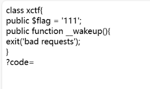
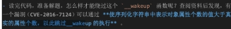
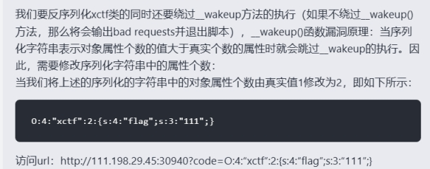
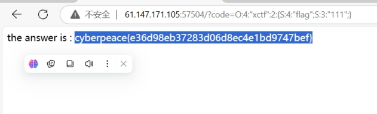

 

最重要的是这一个函数function __wakeup()，配合题目unserialize想到PHP的序列化和反序列化

 

__wakeup()函数用法:

__wakeup()是用在反序列化操作中。unserialize()会检查存在一个__wakeup()方法。如果存在，则先会调用__wakeup()方法。

 

 

 

这句话怎么理解呢？首先，序列化字符串的标准格式：

```
O:<类名的长度>:"<类名>":<成员属性的个数>:{S:<成员属性的长度>:"<成员属性名>";......}
```

这道题的话，如果要对xctf类进行正确的序列化，那么它的字符串应该是： `O:4:"xctf":1:{S:4:"flag";S:3:"111";}`

 

 

 

 

 

 

 

 

 

 