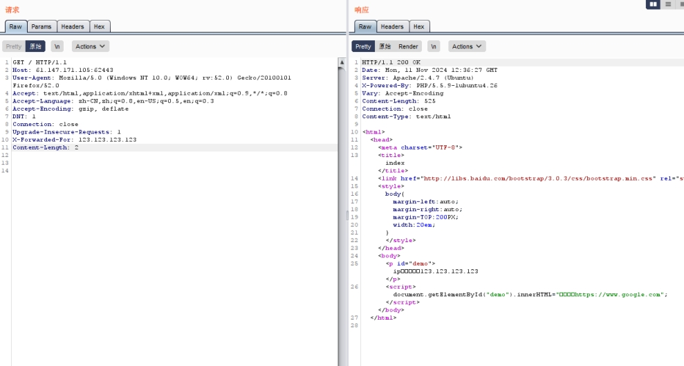

题目描述:

X老师告诉小宁其实xff和referer是可以伪造的。

 

X-Forwarded-For:简称XFF头，它代表客户端，也就是HTTP的请求端真实的IP，只有在通过了HTTP 代理或者负载均衡服务器时才会添加该项

HTTP Referer是header的一部分，当浏览器向web服务器发送请求的时候，一般会带上Referer，告诉服务器我是从哪个页面链接过来的

 

 

 

 

 

 

提示ip地址必须为123.123.123.123

burp抓包，添加X-Forwarded-For：123.123.123.123

 

 

 

提示必须来自https://www.google.com

加入

Referer：https://www.google.com

得到flag

 

 

 