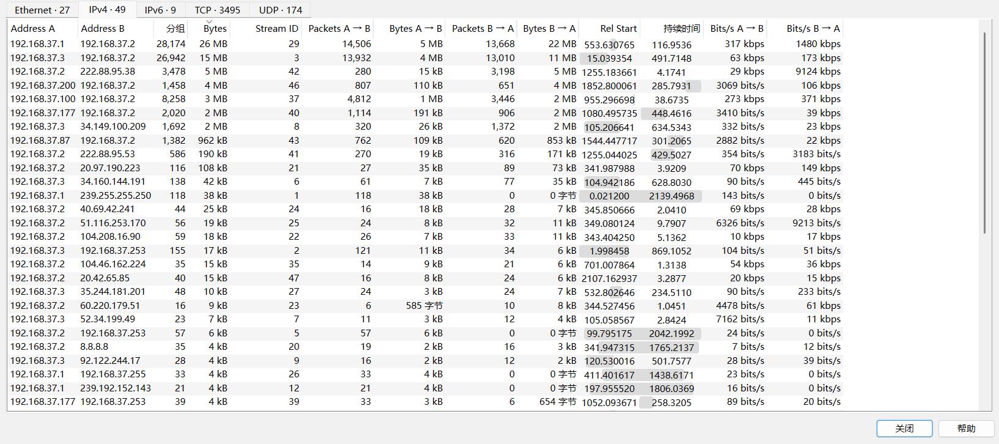
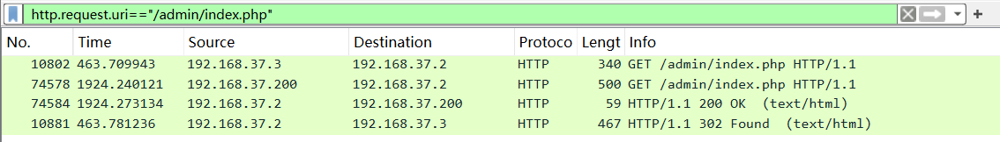

## 要求

```
登录账号密码：administrator/Zhoudi666
```


```
某医院系统疑似被攻击，攻击者常规手段获取到了后台账号密码，在此之前攻击者使用多个IP进行扫描，你作为安全服务工程师需要分析其流量包和日志来快速审计，每个IP的扫描特征并快速归类，并思考在常规渗透中，攻击者是怎么获取到的管理员密码进行登录的后台
此外除了已有需要提交的题目，你还需要做的是
1. 根据桌面已有的工具进行分析
根据桌面已有的文档模板进行编写报告进行整个流程的梳理(后期给客户进行汇报)
2. 修复出现的相关漏洞(无论使用任何方法)，保证业务系统正常运行
3. 看看系统中自己能不能挖出其他漏洞
```


```
1.首次发起端口扫描的IP是
2.审计流量和日志快速定位扫描次数最多的IP
3.审计流量和日志快速定位扫描次数第二的IP
4.哪个IP使用了AWVS扫描器
5.还有个IP也使用了扫描器进行主机+WEB扫描，提交其扫描次数(以wireshark数量为主)
6.运维人员发现有IP进行了WEB登录爆破，提交其IP
7.运维人员发现有IP进行了WEB登录爆破，提交其爆破次数
8.运维发现数据库疑似被写入了垃圾用户(批量注册)请提交其IP
9.运维发现数据库疑似被写入了垃圾用户(批量注册)请提交注册成功数量
10.请提交攻击者登录成功admin用户的IP及密码，以&连接
11.数据库疑似被脱库，你需要找到漏洞点，如漏洞文件
12.找到攻击者获取医院数据(患者身份信息的数量)
```


首先打开流量包，查看会话



大多数流量是发向192.168.37.2

初步判定192.168.37.2是服务器ip


## 端口扫描

首先SYN扫描是最为常见的扫描方式，攻击者通过发送SYN数据包来试探目标端口是否开放

筛选SYN数据包并将目的ip设置为服务器ip

```
tcp.flags.syn==1 && tcp.flags.ack==0 && ip.dst==192.168.37.2
```


简单分析

192.168.37.3存在端口扫描行为


192.168.37.1大部分流量都是发往8080


192.168.37.100也存在端口扫描行为


192.168.37.177大部分流量都是发往8080


192.168.37.87大部分流量都是发往8080


192.168.37.200大部分流量都是发往8080


因此初步判定

192.168.37.3和192.168.37.100存在端口扫描行为

按时间顺序来看192.168.37.3是首次发起端口扫描的IP


## 扫描次数最多的IP

首先根据过滤结果，查看会话

```
tcp.flags.syn==1 && tcp.flags.ack==0 && ip.dst==192.168.37.2
```


其中192.168.37.3的分组最多

然后查看web日志，提取IP，统计次数

```
cat access.log | awk '{print $1}' | sort -nr | uniq -c
```


同样也是192.168.37.3访问次数最多


## 扫描次数第二的IP

根据前面的结果


结合流量日志和web日志，192.168.37.1扫描次数为第二


## 哪个IP使用了AWVS扫描器

AWVS漏洞扫描特征中，请求头和路径中有acunetix特征，以及域名特征

```
bxss.me
```

过滤关键词

acunetix

```
cat access.log| grep acunetix
```


或是过滤bxss.me

```
cat access.log| grep bxss.me
```


提取ip

```
cat access.log| grep acunetix | awk '{print $1}' | uniq -c
```


即192.168.37.1


## 还有个IP也使用了扫描器进行主机+WEB扫描

结合之前所得

192.168.37.3和192.168.37.100这两个IP存在端口扫描行为

那么在web日志中过滤192.168.37.100的行为

```
cat access.log| grep 192.168.37.100 > 192.168.37.100.txt	
```


存在大量404行为，即192.168.37.100进行了主机+WEB扫描

过滤源目IP

```
ip.src==192.168.37.100 && ip.dst==192.168.37.2
```

协议分级


4812次


## WEB登录爆破

登录爆破，那么很大概率是POST方式访问login.php界面

然后我这里是部署的虚拟机


查看登录界面


也就是login.php

```
cat access.log | grep POST | grep login.php | awk '{print $1}' | sort -nr | uniq -c
```


过滤POST和login.php，统计IP次数

其中192.168.37.87存在大量访问行为


## 垃圾用户(批量注册)请提交其IP


注册界面

register.php


```
cat access.log| grep register.php | grep POST |awk '{print $1}' | sort -nr | uniq -c
```


过滤ip

192.168.37.177访问了159次

但是访问次数不代表成功次数

查看register.php文件


插入到users表

连接数据库，查看users表


其中zhangsan用户存在规律，怀疑是批量注册的用户

统计数量

```
SELECT COUNT(*) FROM USERS where username LIKE "%zhangsan%";
```


58次


但是查看users表


然后分析access.log


其中，9:47:21注册的zhangsan是由192.168.37.3操作的

而批量注册用户的ip为192.168.37.177

也就是我们需要删掉由192.168.37.3 注册的一次

也就是57次

但是答案是58


## 登录成功admin用户的IP及密码，以&连接

首先查看业务逻辑，查看login.php


登录成功，跳转到

```
/admin/index.php

/doctor/index.php

/patient/index.php
```

分别过滤

```
http.request.uri=="/admin/index.php"
```



存在两个ip

先查看192.168.37.3


访问/admin/index.php，然后重定向到login.php

也就是该ip可能是扫描目录是扫到了/admin/index.php


然后查看192.168.37.200


成功访问，查看上一个流


POST提交

```
username=admin&password=zhoudi123
```

然后302，重定向到/admin/index.php

即192.168.37.200成功登录，且密码为zhoudi123


## 数据库疑似被脱库，需要找到漏洞点，如漏洞文件

```
cat access.log | awk '{print $1}' | sort -nr | uniq -c 
```


提取所有IP

然后过滤IP，分析行为

其中

192.168.56.200对settings文件存在大量访问行为


wireshark查看

```
 http.request.uri=="/admin/settings.php" && ip.addr==192.168.37.200&&http.request.method==POST
```


```
zhangsan%' UNION ALL SELECT CONCAT(0x7170787071,JSON_ARRAYAGG(CONCAT_WS(0x6f6f6b787571,IFNULL(CAST(`name` AS NCHAR),0x20),IFNULL(CAST(id_card AS NCHAR),0x20))),0x716a766271),NULL,NULL,NULL,NULL FROM hospital_db.patients#
```

该ip在进行sql注入，对patients进行操作

查看该表


是患者的信息

导出该信息


显示为UTF-8

然后利用ai写一个脚本提取关键信息

```
import re

def count_ookxuq_entries(file_path):
    try:
        with open(file_path, 'r', encoding='utf-8') as file:
            content = file.read()

            # 使用正则表达式查找所有包含ookxuq的条目
            pattern = r'"[^"]*ookxuq[^"]*"'
            matches = re.findall(pattern, content)

            # 统计数量
            count = len(matches)

            print(f"找到 {count} 条包含'ookxuq'的身份信息")

            # 可选：打印出找到的条目（调试用）
            # for i, match in enumerate(matches, 1):
            #     print(f"{i}. {match}")

            return count

    except FileNotFoundError:
        print(f"错误：文件 {file_path} 未找到")
        return 0
    except Exception as e:
        print(f"发生错误: {str(e)}")
        return 0

if __name__ == "__main__":
    file_path = "1.txt"  # 你的Wireshark导出的文件
    count_ookxuq_entries(file_path)
```


```
12001
```

