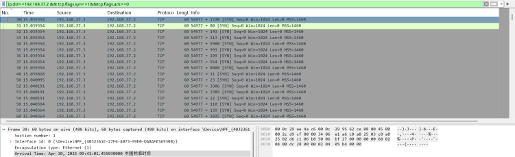
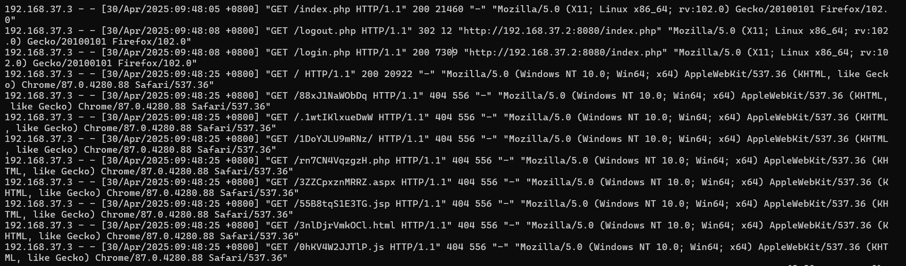
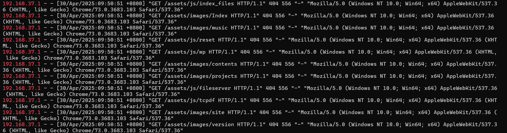
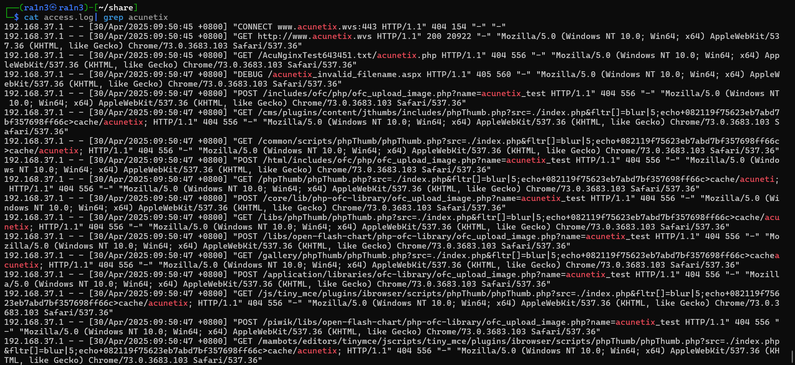

# 网络安全应急响应报告

### 一、事件概述

#### 1、事件发现时间

2025.5.14

#### 2、事件发现方式

wireshark流量和Web日志分析

#### 3、事件简要描述

攻击者通过端口扫描，Web登录界面爆破及批量注册恶意用户等方式实施网络攻击，并利用公网泄露的源代码获取系统配置文件中的数据库凭证，成功入侵管理员后台。

攻击者进一步利用后台SQL注入漏洞，导致大量患者敏感信息泄露，造成严重的数据安全事件。

### 二、应急响应过程

#### 1、响应启动时间

2025.5.14

#### 2、响应团队成员及职责

ra1n3，流量分析，日志审计，并结合流量和日志数据，还原攻击路径（端口扫描->后台入侵->数据泄露），提供修复建议。

#### 3、响应步骤

##### 初步评估

在响应初期，通过对Wireshark流量和Nginx日志的快速分析，初步判断事件为恶意攻击导致的数据泄露，攻击路径如下：

- 攻击类型：组合攻击（端口扫描+目录扫描+登录爆破+SQL注入+信息泄露）
- 严重程度：高危（涉及患者敏感信息泄露）
- 影响范围：
  - 系统影响：Web应用服务器，数据库
  - 数据影响：患者敏感信息
- 攻击者入口：
  - 利用公网泄露的源码获取数据库凭证，通过爆破登录后台
  - 通过settings.php文件的SQL注入漏洞进一步窃取数据

##### 遏制措施

- 网络层封锁
  - 在防火墙/Nginx层封禁攻击源IP
  - 凭证重置：重置数据库账户密码，撤销泄露凭证的访问权

##### 调查分析

- 攻击源IP：192.168.37.3在2025.4.30日上午9点40分左右开始进行了端口扫描

且在2025.4.30日上午9点48分左右进行了web扫描

但是分析该IP行为，其只是进行了大规模的扫描行为，而并未对服务造成实质性的影响

- 攻击源IP：192.168.37.1在2025.4.30日上午9点50分左右进行了web扫描

且使用awvss进行了漏洞扫描

