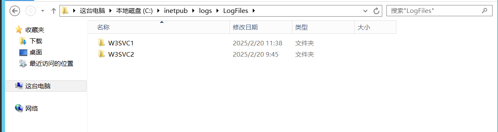
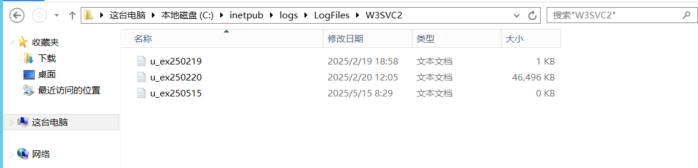
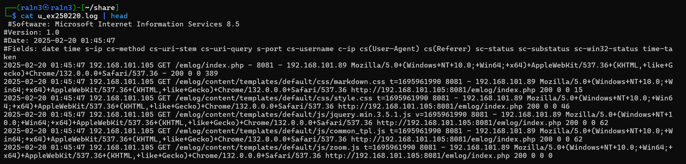
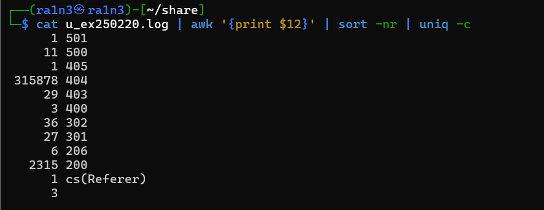
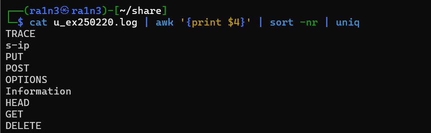
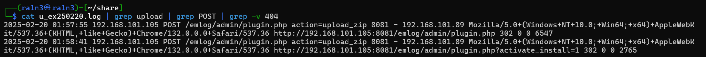
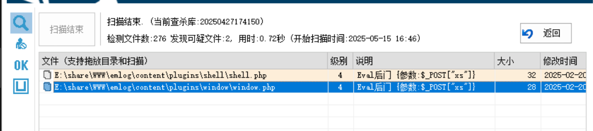

## IIS日志基础

默认路径

```
%SystemDrive%\inetpub\logs\LogFiles\
```


```
1.phpstudy-2018站点日志.(.log文件)所在路径，提供绝对路径
2.系统web日志中状态码为200请求的数量是多少
3.系统web日志中出现了多少种请求方法
4.存在文件上传漏洞的路径是什么（flag{/xxxxx/xxxxx/xxxxxx.xxx})
5.攻击者上传并且利⽤成功的webshell的⽂件名是什么
```


访问

```
%SystemDrive%\inetpub\logs\LogFiles\
```





其中C:\inetpub\logs\LogFiles\W3SVC2\u_ex250220.log

存在大量数据

保存到本地

简单查看



提取响应状态码

```
cat u_ex250220.log | awk '{print $12}' | sort -nr | uniq -c
```



200的为2315次

提取请求方式

```
cat u_ex250220.log | awk '{print $4}' | sort -nr | uniq
```



```
TRACE
PUT
POST
OPTIONS
HEAD
GET
DELETE
```

七种


存在文件上传漏洞的路径，文件上传，首先过滤upload，然后POST方式，最后再利用-v筛选404状态码

```
cat u_ex250220.log | grep upload | grep POST | grep -v 404
```



```
/emlog/admin/plugin.php
```


d盾查杀



两个木马文件