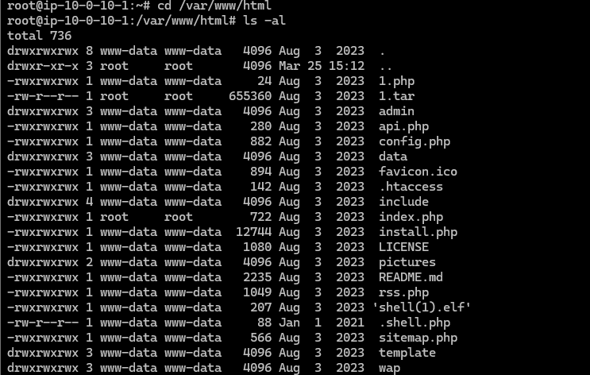
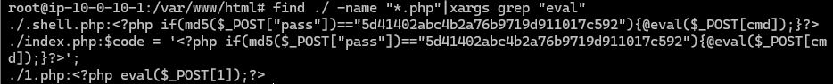
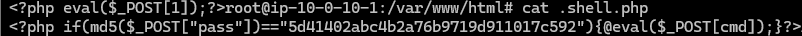
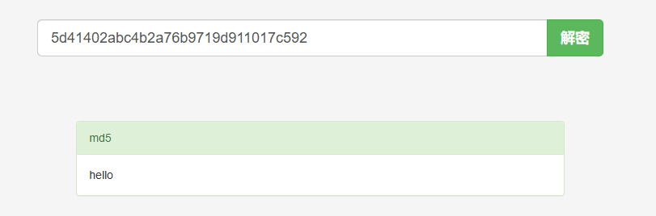
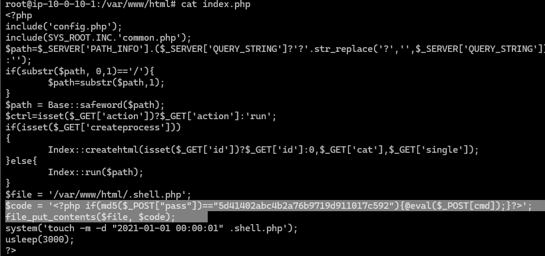
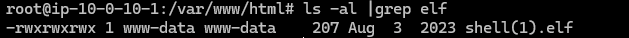
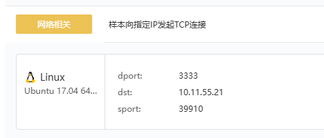
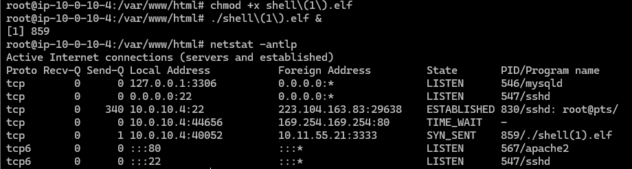

# 第一章 应急响应- Linux入侵排查

```
1.web目录存在木马，请找到木马的密码提交
2.服务器疑似存在不死马，请找到不死马的密码提交
3.不死马是通过哪个文件生成的，请提交文件名
4.黑客留下了木马文件，请找出黑客的服务器ip提交
5.黑客留下了木马文件，请找出黑客服务器开启的监端口提交
```


开启环境后finalshell连接


## 第一题

web目录存在木马，请找到木马的密码提交

进入web目录

```
cd /var/www/html
ls -al
```



寻找可疑文件

```
find ./ -name "*.php"|xargs grep "eval"
```

寻找当前文件夹中的php文件，并过滤出包含eval函数的文件



得到三个文件

- .shell.php
- index.php
- 1.php

挨个查看


其中1.php为一句话木马，密码为1

```
flag{1}
```


## 第二题

服务器疑似存在不死马，请找到不死马的密码提交


.shell.php是一个隐藏文件

查看

```
cat .shell.php
```



存在md5加密

解密后为hello



```
flag{hello}
```


## 第三题

不死马是通过哪个文件生成的，请提交文件名

还剩最后一个index.php文件

```
cat index.php
```



```
flag{index.php}
```


## 第四题

黑客留下了木马文件，请找出黑客的服务器ip提交

elf，linux可执行文件，保存到本地，放入云沙箱中检测





得到目标ip

```
flag{10.11.55.21}
```


## 第五题

黑客留下了木马文件，请找出黑客服务器开启的监端口提交


```
flag{3333}
```


## 另外

也可以选择本地运行，然后查看连接情况

```
chomd +x shell(1).elf
./shell(1).elf &
netstat -antlp
```



首先赋予该文件执行权限

后台运行该文件

查看连接情况

可以看到向10.11.55.21的3333端口发送请求