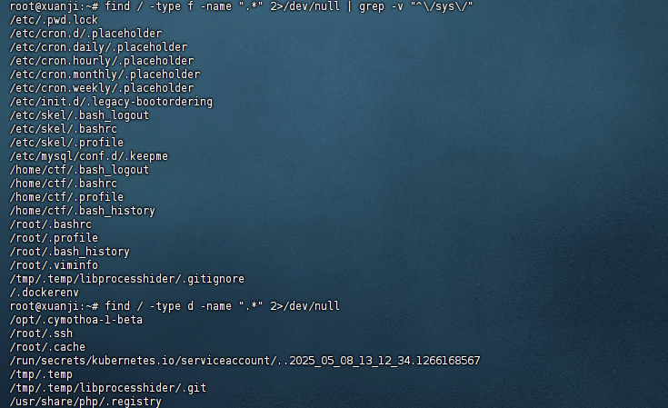
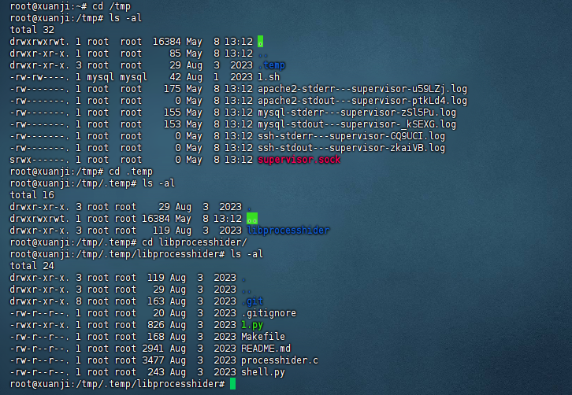
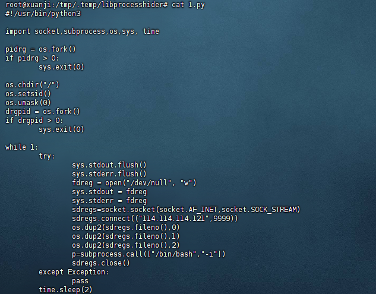
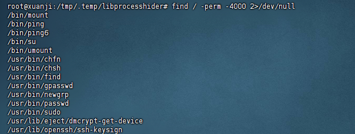
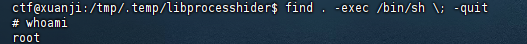
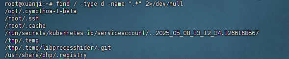
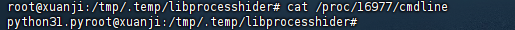
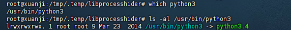

# 第三章 权限维持-linux权限维持-隐藏

```
1.黑客隐藏的隐藏的文件 完整路径md5
2.黑客隐藏的文件反弹shell的ip+端口 {ip:port}
3.黑客提权所用的命令 完整路径的md5 flag{md5} 
4.黑客尝试注入恶意代码的工具完整路径md5
5.使用命令运行 ./x.xx 执行该文件  将查询的 Exec****** 值 作为flag提交 flag{/xxx/xxx/xxx}
```


## 隐藏文件和反弹shell

```
find / -type d -name ".*" 2>/dev/null
```

查找隐藏目录

```
find / -type f -name ".*" 2>/dev/null | grep -v "^\/sys\/" 
```

查找隐藏文件




可以看到tmp目录下有个隐藏目录.temp


```
cd /tmp/.temp/libprocesshider
ls -al
```



其中1.py文件存在执行权限


查看1.py

```
cat 1.py
```



反弹shell脚本，即第一题答案

且第二题反弹shell的ip和端口也在其中


## 提权命令

```
find / -perm -4000 2>/dev/null
```

suid位文件查找



find命令可用来提权


可以尝试切换到ctf用户进行验证

```
su ctf
find . -exec /bin/sh \; -quit
```




## 工具

```
find / -type d -name ".*" 2>/dev/null
```



前面隐藏目录的时候发现了一个工具（Cymothoa）

```
 Cymothoa是一款可以将ShellCode注入现有进程（即插进程）的后门工具。借助这种注入手段，，他能够把shellcode伪装成常规程序。他所注入的后门程序应当能够与被注入的程序（进程）共存，以避免被管理人员和维护人员怀疑。将shellcode注入其他进程，还有另外一项优势：即使目标系统的安全防护工具能够监视可执行程序的完整性，只要他不检测内存，就发现不了（插进程）后门程序的进程。

  该后门注入系统的某一进程，反弹的是该进程相应的权限（并不需要root）。当然，因为后门是运行中的程序为宿主，所以只要进程关闭或者目标主机重启，后门就会停止运行。
```

执行

```
python3 1.py
```


然后查看进程pid

```
netstat -pantu
```


```
cat /proc/16977/cmdline
```



python3


```
which python3 
ls -al /usr/bin/python3
```




