# 第二章日志分析-redis应急响应

## 简单了解redis的攻击手法

### 未授权访问

身份验证：默认情况下，Redis不验证身份，攻击者可以直接连接到Redis实例并执行任意命令

网络接口：如果Redis开放在一个公共的IP上，攻击者可以通过网络远程访问Redis实例

### 远程代码执行

config命令：攻击者可以利用未授权访问，通过config命令动态修改配置，如config dbfilename以及config dir动态修改文件名以及保存路径，从而写入恶意文件，达到在目标服务器上执行恶意代码的目的

模块加载：Redis允许加载自定义模块，如果没有适当的访问控制，攻击者可以加载恶意模块并执行任意代码。

### 持久化攻击：

定时任务：攻击者通过动态修改redis的配置信息，实现定时任务，从而实现反弹shell的目的

免密登录：攻击者利用动态修改redis的配置信息，将自己的公钥写入服务器，从而实现ssh免密登录


```
1、通过本地 PC SSH到服务器并且分析黑客攻击成功的 IP 为多少,将黑客 IP 作为 FLAG 提交;
2、通过本地 PC SSH到服务器并且分析黑客第一次上传的恶意文件,将黑客上传的恶意文件里面的 FLAG 提交;
3、通过本地 PC SSH到服务器并且分析黑客反弹 shell 的IP 为多少,将反弹 shell 的IP 作为 FLAG 提交;
4、通过本地 PC SSH到服务器并且溯源分析黑客的用户名，并且找到黑客使用的工具里的关键字符串(flag{黑客的用户-关键字符串} 注关键字符串 xxx-xxx-xxx)。将用户名和关键字符串作为 FLAG提交
5、通过本地 PC SSH到服务器并且分析黑客篡改的命令,将黑客篡改的命令里面的关键字符串作为 FLAG 提交;
```

```
  注：样本请勿在本地运行！！！样本请勿在本地运行！！！样本请勿在本地运行！！！
```

ssh连接

```
 ssh root@69.230.246.108
```

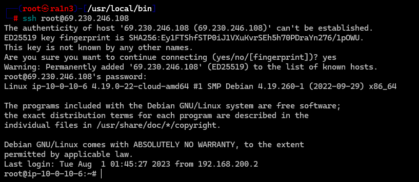


## 第一题

通过本地 PC SSH到服务器并且分析黑客攻击成功的 IP 为多少,将黑客 IP 作为 FLAG 提交;

```
cd /var/log
ls -al
```

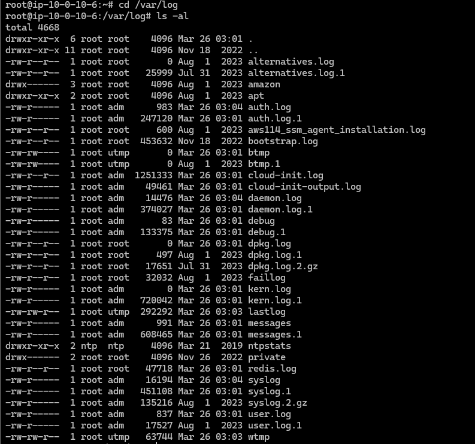

查看redis.log文件

```
cat redis.log
```

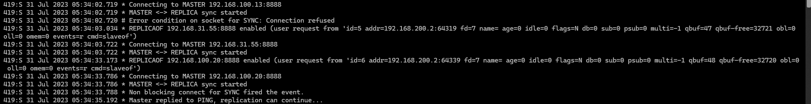

分析，连接的关键字

Connecting

然后提取ip信息

```
cat redis.log | grep -a "Connecting"|awk '{print $10}'|sort|uniq -c
```

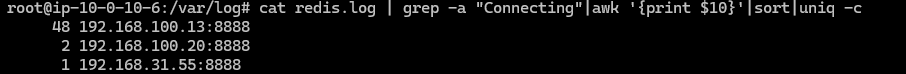

并在日志中观察其行为

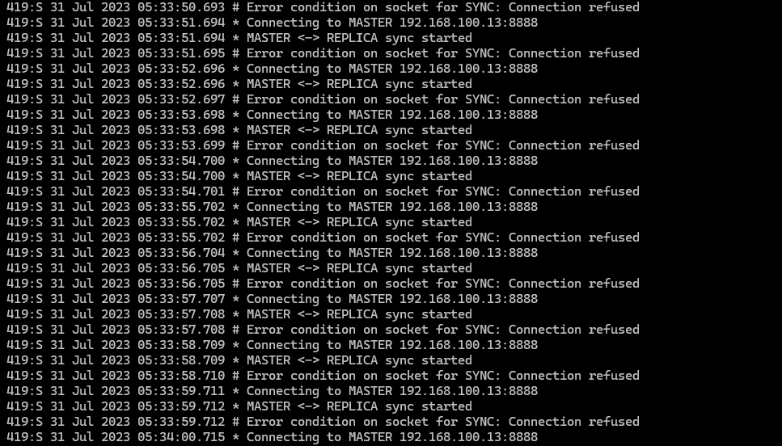

这一部分可以看到192.168.100.13该ip在持续爆破

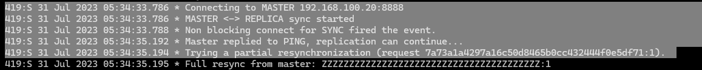

这一部分可以看到192.168.100.20成功连接

```
flag{192.168.100.20}
```


## 第二题

通过本地 PC SSH到服务器并且分析黑客第一次上传的恶意文件,将黑客上传的恶意文件里面的 FLAG 提交;

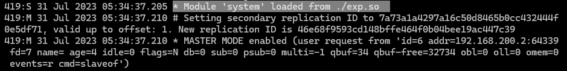

在这里可以看到恶意模块exp.so被成功加载

查找该文件

```
find / -name "exp.so"
```

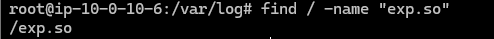

保存到本地，010查看

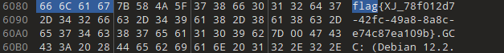

```
flag{XJ_78f012d7-42fc-49a8-8a8c-e74c87ea109b}
```


## 第三题

通过本地 PC SSH到服务器并且分析黑客反弹 shell 的IP 为多少,将反弹 shell 的IP 作为 FLAG 提交;

结合redis的利用方式：定时任务反弹shell

查看定时任务

```
crontab -l
```

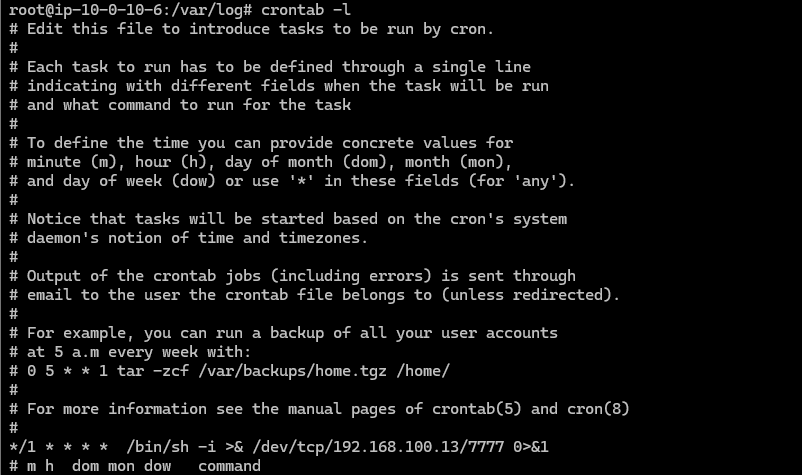

```
flag{192.168.100.13}
```


## 第四题

通过本地 PC SSH到服务器并且溯源分析黑客的用户名，并且找到黑客使用的工具里的关键字符串(flag{黑客的用户-关键字符串} 注关键字符串 xxx-xxx-xxx)。将用户名和关键字符串作为 FLAG提交

结合redis写入公钥实现免密登录

查看ssh服务信息

```
cd ~/.ssh
ls -al
cat authorized_keys
```

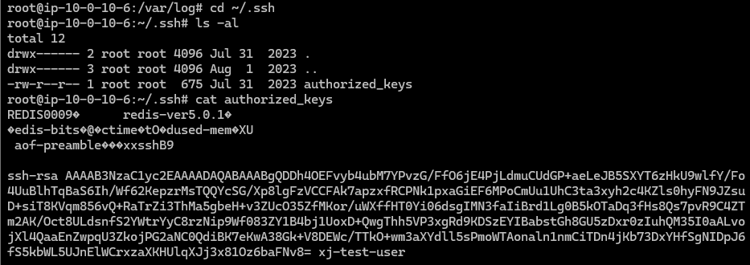

存在用户名

```
xj-test-user
```

github查找该用户

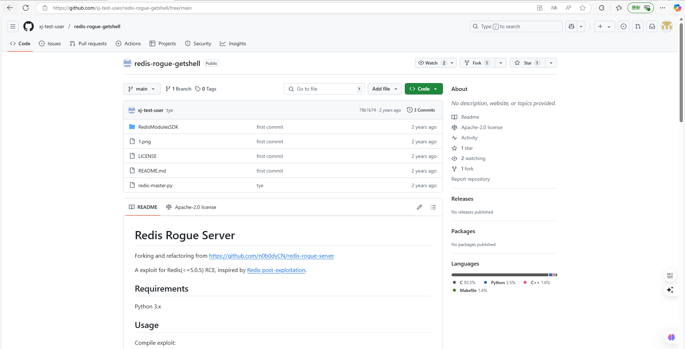

但是关键字符串我是真没找到


## 第五题

通过本地 PC SSH到服务器并且分析黑客篡改的命令,将黑客篡改的命令里面的关键字符串作为 FLAG 提交;

进入到bin目录下

```
cd /bin
ls -lt
```

ls -t参数表示按时间排序

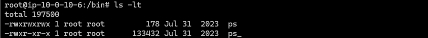

```
strings ps
```

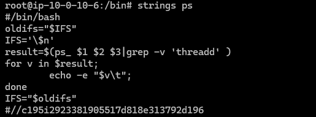

```
flag{c195i2923381905517d818e313792d196}
```

