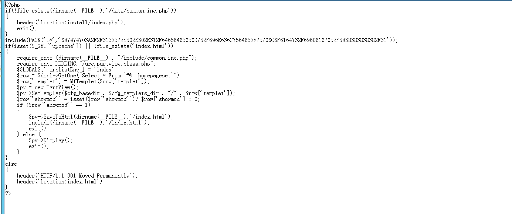

## index1.php

访问http://127.0.0.1/dedecms/index1.php


找到index1.php


源码被篡改，删除title和h1


重新访问


修复成功


## index2.php

访问http://127.0.0.1/dedecms/index2.php


url跳转到http://127.0.0.1/dedecms/heiye/index2.html

首先查看index2.php


有一处文件包含（/include/common.inc.php）

找到该文件


删除

```
Header("Location:./heiye/index2.html");
```


重新访问http://127.0.0.1/dedecms/index2.php


修复成功


## index3.php

访问http://127.0.0.1/dedecms/index3.php


跳转到http://127.0.0.1/dedecms/heiye/index3.html

查看index3.php源码


js源码解密


找到该js文件


删除该index3.php中的js源码和1.js文件


修复成功


## index4.php

访问127.0.0.1/dedecms/index4.php


跳转到http://127.0.0.1/dedecms/heiye/index2.html

找到index4.php


依旧找到包含的文件（/include/common3.inc.php）

但是目录下没找到，利用给出的everything查找


查看源码


依旧删除Header部分


修复成功


## index5.php

访问http://127.0.0.1/dedecms/index5.php


跳转到http://127.0.0.1/dedecms/heiye/index5.html

找到index5.php



解密include包含的内容


找到该文件


删除该文件和include内容


成功修复