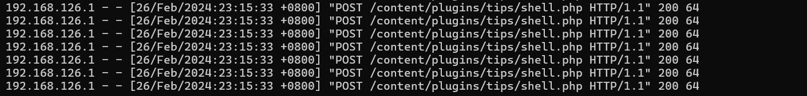
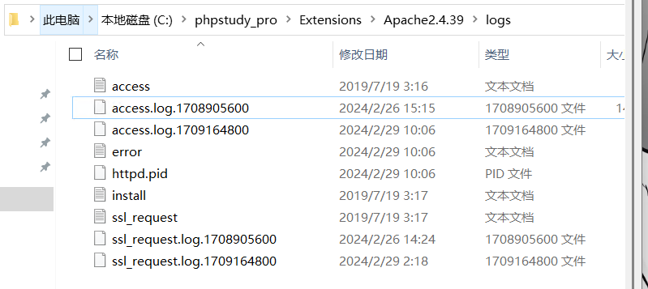
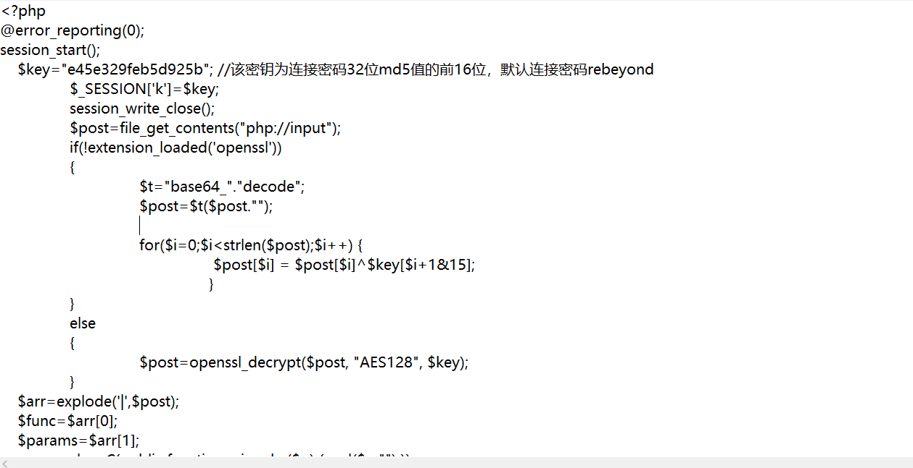
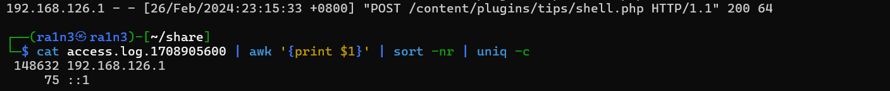
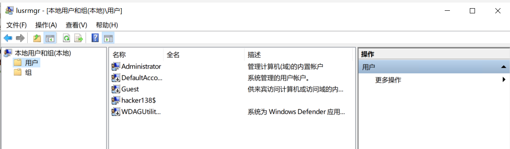
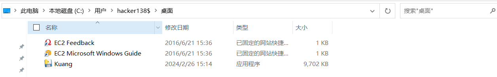
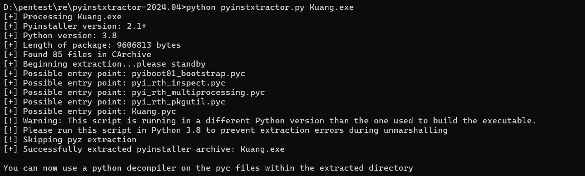
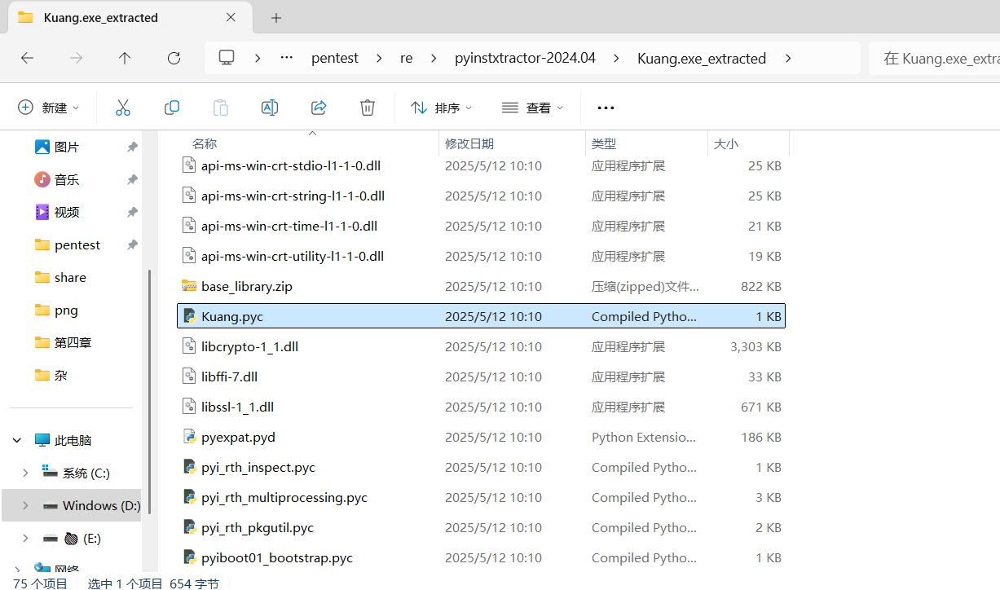
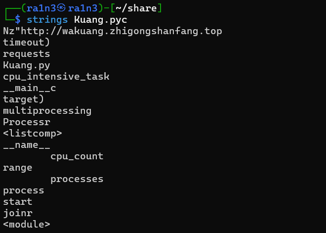
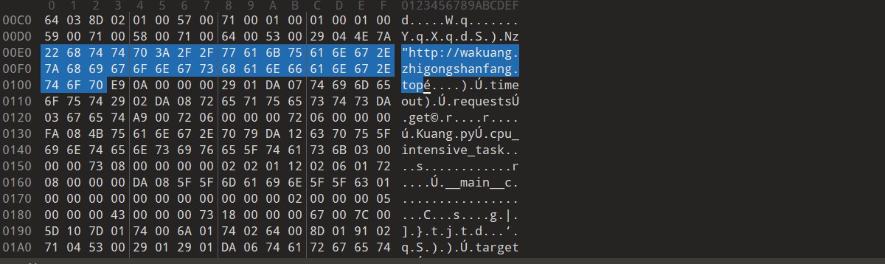

```
通过本地 PC RDP到服务器并且找到黑客植入 shell,将黑客植入 shell 的密码 作为 FLAG 提交;

通过本地 PC RDP到服务器并且分析黑客攻击成功的 IP 为多少,将黑客 IP 作为 FLAG 提交;

通过本地 PC RDP到服务器并且分析黑客的隐藏账户名称,将黑客隐藏账户名称作为 FLAG 提交;

通过本地 PC RDP到服务器并且分析黑客的挖矿程序的矿池域名,将黑客挖矿程序的矿池域名称作为(仅域名)FLAG 提交;
```


## shell的密码

打开phpstudy

定位到apache日志路径，将access.log保存到本地

查看日志内容



找到shell.php





冰蝎马

```
rebeyond
```


## 黑客IP

其实上一题已经得到，即访问shell.php的就是黑客ip

或者再手动提取

```
cat access.log.1708905600 | awk '{print $1}' | sort -nr | uniq -c
```




## 黑客的隐藏账户名称

查看本地用户和组管理器

```
win+r
lusrmgr.msc
```



```
hacker138
```


## 挖矿程序的矿池域名

进入隐藏用户的桌面路径下

有一个python编译的exe文件



保存到本地

利用pyinstxtractor进行反编译

```
python pyinstxtractor.py Kuang.exe
```



得到kuang.pyc



利用strings提取其中字符串

```
strings Kuang.pyc
```




或者010打开


