```
请提交攻击者攻击成功的第一时间，格式：flag{YY:MM:DD hh:mm:ss}
请提交攻击者的浏览器版本 flag{Firgfox/2200}
请提交攻击者目录扫描所使用的工具名称
找到攻击者写入的恶意后门文件，提交文件名（完整路径）
找到攻击者隐藏在正常web应用代码中的恶意代码，提交该文件名（完整路径）
请指出可疑进程采用的自动启动的方式，启动的脚本的名字 flag{1.exe}
```


## 攻击者攻击成功的时间，浏览器版本和工具以及后门文件名

首先打开phpstudy，定位到日志路径

首先查看apache日志，但是大小都很小

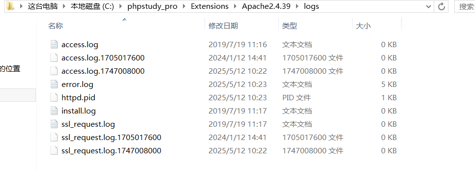

而nginx日志稍微大一点

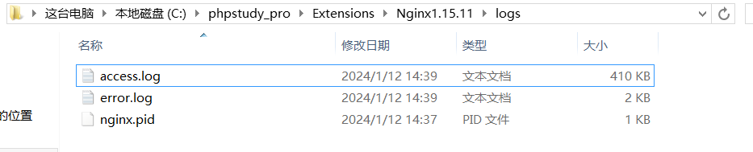

因此查看nginx的access日志

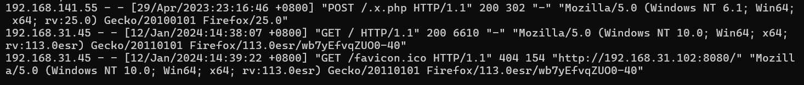

提取ip

```
cat access.log | awk '{print $1}' | sort -nr | uniq -c
```

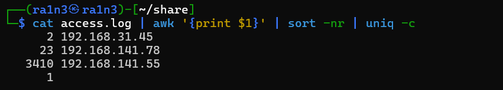

其中192.168.141.55存在大量访问行为

即该ip为攻击者ip

提取该ip的访问日志

```
cat access.log | grep 192.168.141.55 > ra1n3.txt
```

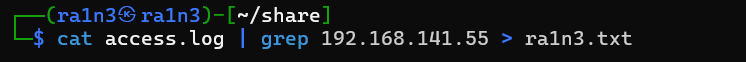

前面存在大量404，即攻击者在进行目录扫描

而后面的POST访问login页面后，返回了welcome.php

即攻击成功，时间为29/Apr/2023:22:45:23

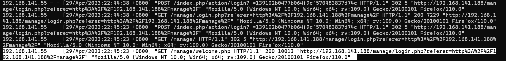

且浏览器为

```
Firefox/110.0
```

而前面目录扫描的工具为

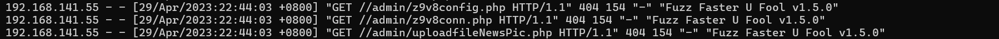

```
Fuzz Faster U Fool v1.5.0
```

后面利用.x.php执行命令，即.x.php为后门文件

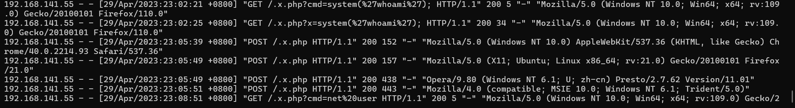


## 隐藏在正常web应用代码中的恶意代码

首先将www目录保存到本地，然后查杀php马

```
find ./ -type f -iname "*.*" |xargs egrep 'assert|bash|system|phpspy|c99sh|milw0rm|eval|\(gunerpress|\(base64_decoolcode|spider_bc|shell_exec|passthru|\(\$\_\POST\[|eval\(|file_put_contents|base64_decode'
```

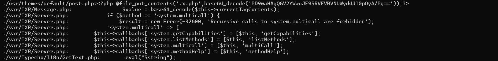

其中post.php，利用file_put_contents实现写入木马文件

则文件路径为

```
C:\phpstudy_pro\WWW\usr\themes\default\post.php
```


## 可疑进程采用的自动启动的方式

在C:\Windows路径下，存在一个360.exe和x.bat

而x.bat用于启动360.exe

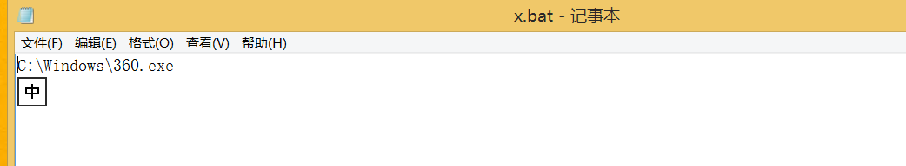

将360.exe保存到本地，放入云沙箱中检测

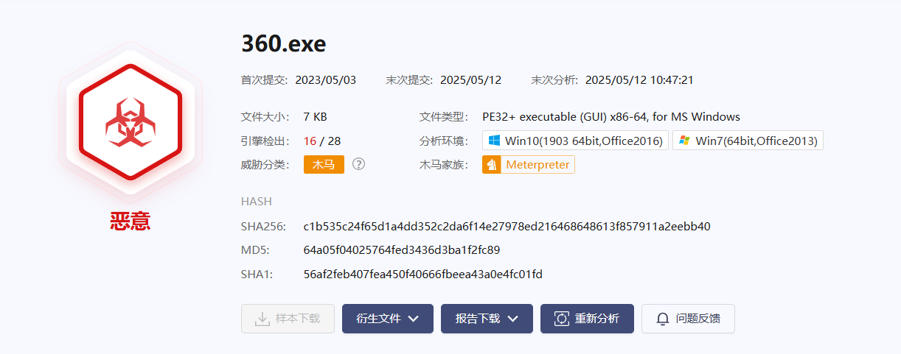

木马文件，则可疑进程采用的自动启动的脚本名字为x.bat