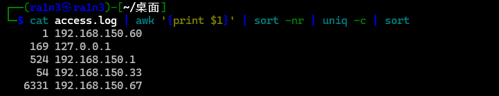
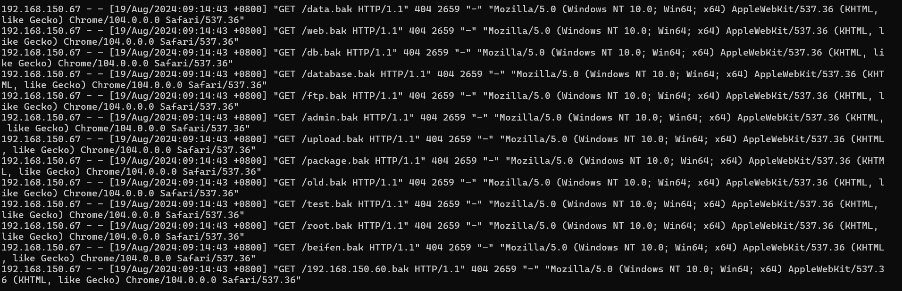
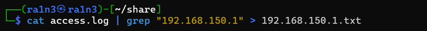
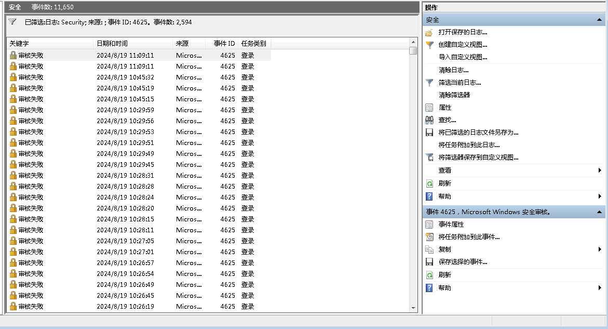
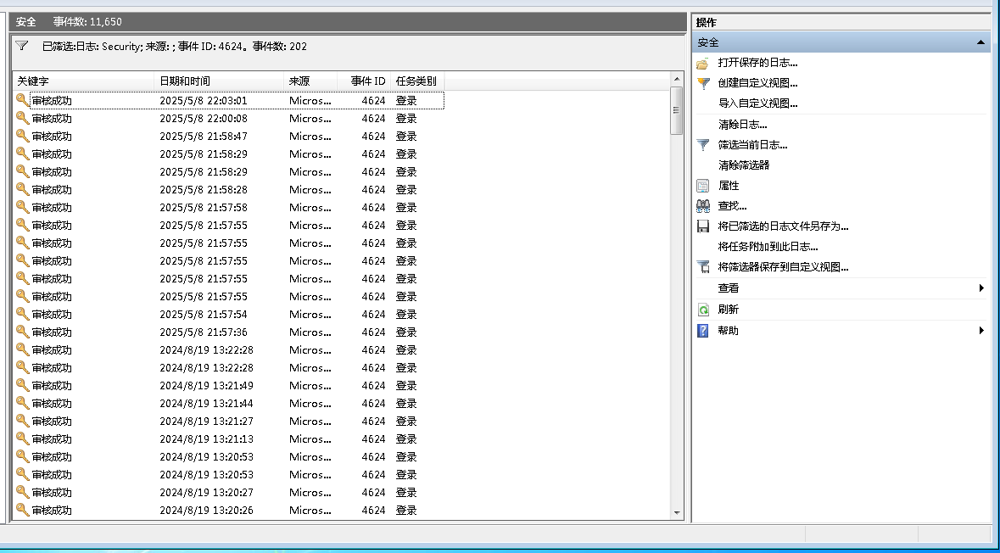
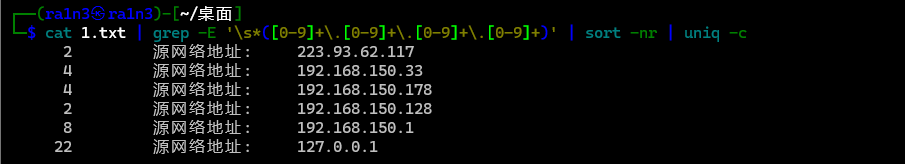
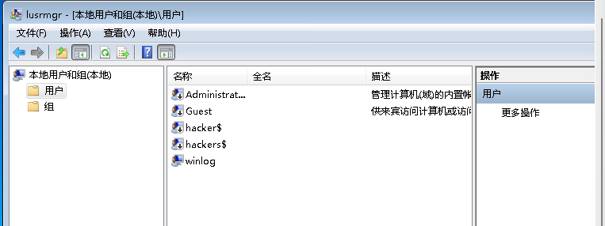
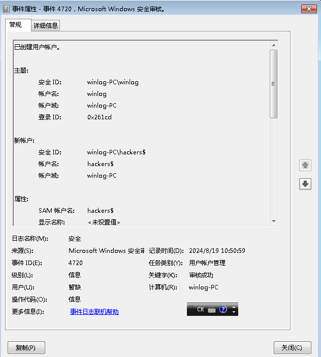
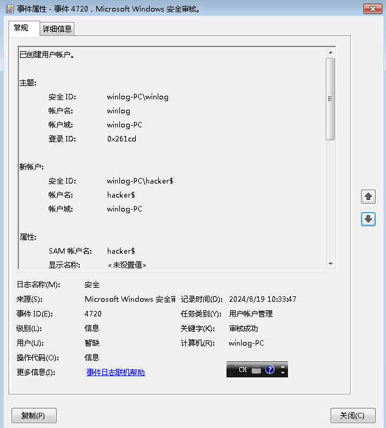

```
审计桌面的logs日志，定位所有扫描IP，并提交扫描次数
审计相关日志，提交rdp被爆破失败次数
审计相关日志，提交成功登录rdp的远程IP地址，多个以&连接,以从小到大顺序排序提交
提交黑客创建的隐藏账号
提交黑客创建的影子账号
提交远程shell程序的连接IP+端口，以IP:port方式提交
黑客植入了一个远程shell，审计相关进程和自启动项提交该程序名字
黑客使用了计划任务来定时执行某shell程序，提交此程序名字
```


# 定位扫描ip，提交扫描次数

将log文件夹中的access文件拷贝到本地

利用awk提取ip

```
cat access.log | awk '{print $1}' | sort -nr | uniq -c | sort
```



首先127.0.0.1是服务器ip，首先排除

而192.168.150.60只有一次访问记录，排除

而192.168.150.67存在大量访问请求，判断其为扫描ip，因此次数是6331，但是提交不对

然后分别提取ip分析其行为

```
cat access.log | grep "192.168.150.67" > 192.168.150.67.txt
```




存在大量扫描行为

```
cat access.log | grep "192.168.150.1" > 192.168.150.1.txt
```



正常访问

```
cat access.log | grep "192.168.150.33" > 192.168.150.33.txt
```


192.168.150.33该ip也存在扫描行为

则正确次数为6385


## rdp被爆破失败次数

打开事件查看器

筛选4625事件（失败的账户登陆事件）



2594次


## 提交成功登录rdp的远程IP地址

筛选4624（成功的账户登录事件）



202条

将筛选结果保存到为1.txt


利用grep过滤ip

```
cat 1.txt | grep -E '\s*([0-9]+\.[0-9]+\.[0-9]+\.[0-9]+)' | sort -nr | uniq -c
```



然后再查看其登录时间，其中三个为正确的


## 黑客创建的隐藏账号

利用lusrmgr打开本地用户和组管理器




两个隐藏用户

hacker$和hackers$


或者筛选事件日志4720







## 远程shell程序的连接IP+端口，以IP:port方式提交

