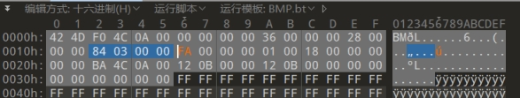

# Bmp 结构

文件头 42 4D 

 

bmp每个像素点由三个字节表示

 

 

 

 

宽 19--22字节

 

高 23--26字节

 

 

# Png 结构

 

 

 

 

 ***\*png\****

***\*文件格式\****

对于PNG文件来说，其文件头总是由固定的字节来描述的，剩余的部分由3个以上的PNG数据块（Chunk）按照特定的顺序组成。

***\*文件头\****

文件头：89 50 4E 47 0D 0A 1A 0A + 数据块 + 数据块 + 数据块…..

***\*数据块\****

PNG 定义了两种类型的数据块，一种是称为关键数据块（critical chunk），这是标准的数据块，另一种叫做辅助数据块（ancillarychunks），这是可选的数据块。关键数据块定义了 4 个标准数据块，每个 PNG 文件都必须包含它们，PNG 读写软件也都必须要支持这些数据块。

 

 

 

对于每个数据块都有着统一的数据结构，每个数据块由 4 个部分组成

 

以下是详细数据块

***\*IHDR（文件头数据块）\****

文件头数据块 IHDR（HeaderChunk）：它包含有 PNG 文件中存储的图像数据的基本信息，由 13 字节组成，并要作为第一个数据块出现在 PNG 数据流中，而且一个 PNG 数据流中只能有一个文件头数据块，其中我们只关注前8字节的内容(!!这里出题啊!!!)

 

CTF 经常会去更改一张图片的高度或者宽度使得一张图片显示不完整从而达到隐藏信息的目的。

Kali中不可以打开，提示文件头错误，而Windows自带的图片查看器可以打开，就提醒了我们IHDR被人篡改过。

找到数据块更改长宽高 即可

***\*IDAT（图像数据块）\****

IDAT：存储实际的数据，在数据流中可包含多个连续顺序的图像数据块。

***\** IDAT块只有当上一个块充满时，才会继续下一个新块。\*\****

***\*idat\*******\*块\**** ***\*49 44 41 54\**** 

***\*可以修复\****

 

 

# Jpg 结构

# Gif 结构

文件头

47 49 46 38 39 61 

 

 

宽

 

 

高

 

 

 

 

结尾

0x3B

 

#  riff结构

52 49 46 46

对应的ASCII字符为：RIFF

 

 

 

接着是对应的具体的文件类型

AVI文件：

41 56 49 20

WEBP文件：

57 45 42 50

 

# tiff结构

小端序：

前四个字节：

49 49 2A 00

 

其中：

49 49表示小端序

2A 00 固定标识符，表示TIFF文件格式

 

 

 

 

大端序：

前四个字节：

4D 4D 00 2A

4D 4D 表示大端序

00 2A 固定标识符，表示TIFF文件格式

 

# zip结构

504B0304

# rar结构

文件头：52617221

# 总结

jpg图片宽高不做限制

可以自由更改

 

png图片需要经过crc冗余检验后得到正确宽高

 

bmp图片需要根据像素得到正确宽高

bmp是倒向位图，因此在十六进制数上修改时要倒着写

也可以在010中套模板直接修改

bmp宽高：

（尾部-头部）/3/正确的宽（正确的高）=高（宽）

（总数据长度可以在010中查看）

 

 

 