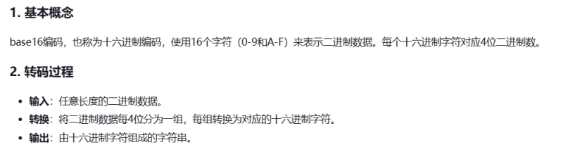
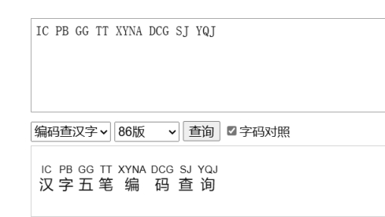
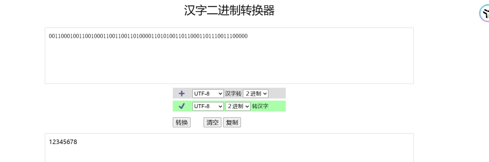

# 简述

编码不同于密码，他的关键不是隐藏信息，而是处理信息，是信息的另一种表示形式，其作用主要用于解决一些特殊字符，不可见字符的传输问题。

 

将原始信息变成编码信息的过程为 ***\*「编码 Encoding 」\****，反之，将编码信息转化回原始信息，转化的过程称之为 ***\*「解码 Decoding 」\****。

 

编码是一个很庞大的家族，因此使用工具来处理编码是及其必要的

 

 

CyberChef：

[GitHub - gchq/CyberChef: The Cyber Swiss Army Knife - a web app for encryption, encoding, compression and data analysis](https://github.com/gchq/CyberChef)

 

 

Ciphey：

[GitHub - Ciphey/Ciphey: ⚡ Automatically decrypt encryptions without knowing the key or cipher, decode encodings, and crack hashes ⚡](https://github.com/Ciphey/Ciphey)

 

 

随波逐流编码工具：

[随波逐流信息安全网](http://1o1o.xyz/bo_ctfcode.html)


 

[CTF中常见密码题解密网站总结_ctf解密网站-CSDN博客](https://blog.csdn.net/qq_41638851/article/details/100526839)

 

## ASCII编码


 

特点

一般使用的aciss编码采用的都是可见字符，主要为：

0-9，48-57

A-Z，65-90

a-z，97-122

 


##  二进制编码

将ascii码对应的数字换成二进制表示形式

特点：

只有0和1

不大于8位，一般7位也可以，因为可见字符到127

其实是另一种ascii编码

 

二进制由0和1组成：

【联想】：两种状态的表示很容易联系到其他编码，如摩尔斯电码，二维码（两种色块），再进一步，黑白色块或者黑白两种颜色的图片排布等等

【数据表示】：作为计算机领域最底层的基础，二进制与数据转换和表示密切相关，比如字符可以通过ASCII码表转换成对应x位二进制


## 十六进制编码

Hex Hexadecimal 意为十六进制

 

将ascii码对应的数字换成十六进制表示形式

 

A-Z ->0x41~0x5A

a-z ->0x61~0x7A

 

 

From Hex to String

十六进制转字符

 

## Base家族

 

Base xx中的xx表示的是采用多少字符进行编码

 

特点：

Base64结尾可能会有=号，但最多有两个

Base32结尾可能会有=号，但最多有六个

根据base的不同，字符集会有所限制

有可能需要自己加等号

 

 

 

Base 16

 

 

Base 32

 

 

Base 64

 

###  Base64换表

Base64有多个表，常用的标准表为

ABCDEFGHIJKLMNOPQRSTUVWXYZabcdefghijklmnopqrstuvwxyz0123456789+/

不过，如果不考虑base64使用需求，我们可以打乱这个表，也可以用另外的标准ASCII字符来替换这个表，只要满足有64个标准元素即可

 


## URL 编码


又称百分号编码，是一种编码机制，用于将不安全或特殊的字符转换为%后跟其ASCII的十六进制表示，以确保URL的安全传输

通常url编码只会处理符号和不可见字符，

通常的 url 编码只会处理符号和不可见字符，

比如 

Squdgy fez, blank jimp crwth vox

会被编码为

 Squdgy%20fez%2C%20blank%20jimp%20crwth%20vox (普通类型)

但在 CTF 中我们可能会将其编码为

%53%71%75%64%67%79%20%66%65%7a%2c%20%62%6c%61%6e%6b%20%6a%69%6d%70%20%63%72%77%74%68%20%76%6f%78 (复杂类型)

 

甚至出现多次 Url 编码的情况

但是在渗透过程中，多次 url 编码确实是一种有效的 Bypass 手段。

 

特点：存在大量百分号%

 


## Unicode编码

Test@123 / 测试@123

 

 

 

 

 

[在线编码转换](https://tool.oschina.net/encode?type=3)


## XXencoding


XXencode将输入文本以三个字节为单位进行编码

如果最后剩下的内容少于三个字节，不够的部分用零补齐

这三个字节共有24个bit，以6bit为单位分为4个组，每个组以十进制来表示所出现的数值只会落在0到63之间。以所对应值的位置字符代替

 

 

 

特点：

只有数字，大小写字母

+号，-号

 

 

 

 

 

***\*XXencode\****是一种二进制到文字的编码！它跟UUencode以及Base64编码方法很类似。它也是定义了用可打印字符表示二进制文字一种方法，不是一种新的编码集合。XXencode将输入文本以每三个字节为单位进行编码，如果最后剩下的资料少于三个字节，不够的部份用零补齐。三个字节共有24个Bit，以6-bit为单位分为4个组，每个组以十进制来表示所出现的字节的数值。这个数值只会落在0到63之间。它64可打印字符固定字符范围及顺序！包括大小写字母、数字以及+-字符。它较UUencode编码优点在于它64字符是常见字符，没有任何特殊字符！

 

 

[XXencode 编码，XX编码介绍、XXencode编码转换原理、算法-程默的博客](http://blog.chacuo.net/778.html)

 


## UUencode编码

***\*UUencode\****是一种二进制到文字的编码！它不是MIME编码中一员。最早在unix 邮件系统中使用，全称：Unix-to-Unix encoding。它也是定义了用可打印字符表示二进制文字一种方法，并不是一种新的编码集合。Uuencode将输入文本以每三个字节为单位进行编码，如果最后剩下的资料少于三个字节，不够的部份用零补齐。三个字节共有24个Bit，以6-bit为单位分为4个组，每个组以十进制来表示所出现的字节的数值。这个数值只会落在0到63之间。然后将每个数加上32，所产生的结果刚好落在ASCII字符集中可打印字符（32-空白…95-底线）的范围之中。跟Base64具有非常多的类似，也做了一些特殊转码说明！因为对所有文本都会编码一次可读性不是很好！！

 

 

[在线UUencode编码|在线UUencode解码|UU编码|UU解码|UUencode编码原理介绍--查错网](http://web.chacuo.net/charsetuuencode)

 

 

## Morse code

 国际摩尔斯电码：

一点的长度是一个单位

一划是三个单位

在一个字母中点划之间的间隔是一点

两个字母之间的间隔是三点（一划）

两个单词之间的间隔是七点

 

 

 

 

 

 

特点：

只有  .  和  -

最多 6 位

也可以使用01串表示

 

[摩尔斯电码转换器：在线进行摩尔斯电码和英文字母的相互转换，可以把莫尔斯电码转换为英文字母，也可把英文字母转换为摩尔斯电码](http://www.zhongguosou.com/zonghe/moErSiCodeConverter.aspx)

 

 

 


##  HTML实体编码


 


##  敲击码

这是一种以非常简单的方式对文本信息进行编码的方法

敲击码是基于5*5放过波利比奥斯方阵来实现的，不同点是 K字母被整合到C中

 

 

 


## Shellcode编码

原文：Test@123

 

 

\x54\x65\x73\x74\x40\x31\x32\x33

 


## 与佛论禅


 

 

 

 

[与佛论禅](https://www.keyfc.net/bbs/tools/tudoucode.aspx)

 

 

## 社会主义核心价值观加密


 

 

## 阴阳怪气编码


 

[GitHub - mmdjiji/yygq.js: 阴阳怪气编码](https://github.com/mmdjiji/yygq.js?tab=readme-ov-file)

 

[阴阳怪气编码](https://std.ac/yygq.js/)

 


## Brainfuck


[Brainfuck/Ook! Obfuscation/Encoding [splitbrain.org\]](https://www.splitbrain.org/services/ook)

 

+++++ +++++ [->++ +++++ +++<] >++.+ +++++ .<+++ [->-- -<]>- -.+++ +++.<

++++[ ->+++ +<]>+ +++.< +++++ +[->- ----- <]>-- ----- --.<+ +++[- >----

<]>-- ----- .<+++ [->++ +<]>+ +++++ .<+++ +[->- ---<] >-.<+ +++++ [->++

++++< ]>+++ +++.< +++++ [->-- ---<] >---- -.+++ .<+++ [->-- -<]>- ----- .<

这种为Brainfuck加密

 

 

 

 

 

 

Brainfuck

特征：用> < + - . , [ ]八种符号，有大量的+号

题目：

 

6个符号组成

 

 

## JJEncode

```
_=~[];_={___:++_,$$$$:(![]+"")[_],__$:++_,$_$_:(![]+"")[_],_$_:++_,$_$$:({}+"")[_],$$_$:(_[_]+"")[_],_$$:++_,$$$_:(!""+"")[_],$__:++_,$_$:++_,$$__:({}+"")[_],$$_:++_,$$$:++_,$___:++_,$__$:++_};_.$_=(_.$_=_+"")[_.$_$]+(_._$=_.$_[_.__$])+(_.$$=(_.$+"")[_.__$])+((!_)+"")[_._$$]+(_.__=_.$_[_.$$_])+(_.$=(!""+"")[_.__$])+(_._=(!""+"")[_._$_])+_.$_[_.$_$]+_.__+_._$+_.$;_.$$=_.$+(!""+"")[_._$$]+_.__+_._+_.$+_.$$;_.$=(_.___)[_.$_][_.$_];_.$(_.$(_.$$+"\""+_.__+_.$$$_+"\\"+_.__$+_.$$_+_._$$+_.__+"\"")())();
```

 

 

 

 

 

## JJEncode编码

特征：大量 $、_ 符号，大量重复的自定义变量

[]()!+,\"$.:;_{}~=

例题：

 

八个符号组成


jsfuck （jother编码）

(!![]+[])[+[]]+(!![]+[])[!+[]+!+[]+!+[]]+(![]+[])[!+[]+!+[]+!+[]]+(!![]+[])[+[]]

 

随波逐流


 JSFuck编码

特征：[]()!+组成

例题：

 

 

 


## 图片码


 

 

 

 

 

 

 

 

 

 

 

 

[在线二维码识别,二维码解码 - 兔子二维码](https://tuzim.net/decode/)

[Barcode Reader. Free Online Web Application](https://online-barcode-reader.inliteresearch.com/)

[在线二维码解码器 二维码安全检测工具](https://jiema.wwei.cn/)

[二维码生成/解码器 - 站长工具](https://ntool.chinaz.com/tools/qrCode)

 

## 花朵编码

[文本加密为花朵符号,可自设密码|文本在线加密解密工具 (qqxiuzi.cn)](https://www.qqxiuzi.cn/bianma/wenbenjiami.php?s=huaduo)

 

 

 

 

 

## emoji加密


 

[emoji-aes](https://aghorler.github.io/emoji-aes/)

 


## 电报码

 

[中文电码转换 - 在线工具栏](https://usetoolbar.com/convert/cccn.html)

 

 

 

 

 

 

 

 

##  音符加密

[文本加密为音乐符号,可自设密码|文本在线加密解密工具 (qqxiuzi.cn)](https://www.qqxiuzi.cn/bianma/wenbenjiami.php?s=yinyue)

♭♯♪‖¶♬♭♭♪♭‖‖♭♭♬‖♫♪‖♩♬‖♬♬♭♭♫‖♩♫‖♬♪♭♭♭‖¶∮‖‖‖‖♩♬‖♬♪‖♩♫♭♭♭♭♭§‖♩♩♭♭♫♭♭♭‖♬♭‖¶§♭♭♯‖♫∮‖♬¶‖¶∮‖♬♫‖♫♬‖♫♫§=


## 汉字五笔编码

[汉字五笔编码批量查询：86版五笔编码、98版五笔编码、18030版五笔编码；五笔编码反查汉字 - 千千秀字](https://www.qqxiuzi.cn/bianma/wubi.php)

 

 

 

 

 

 

 

 


## LOGO编程


## 零宽字符


 

 

***\*
\**** 

[Unicode Steganography with Zero-Width Characters](https://www.mzy0.com/ctftools/zerowidth1/)

 

## 猪圈密码

[CTF在线工具-在线猪圈密码加密|在线猪圈密码解密|猪圈密码算法|Pigpen Cipher](http://www.hiencode.com/pigpen.html)

 

 

 

## snow隐写

扫描得到

 

 

提取

分别查看

 

 

 

 

 

 

 

根据snow判断

snow雪花隐写

key为：他朝若是同淋雪

 

 

 

## 二进制转汉字

[汉字二进制转换器，字符与2-36进制相互转换 - 千千秀字](https://www.qqxiuzi.cn/bianma/erjinzhi.php)

 

 

进行二进制转汉字

 

 

 


## 0ok!编码

Ook. Ook. Ook. Ook. Ook. Ook. Ook. Ook. Ook. Ook. Ook. Ook. Ook. Ook. Ook.

Ook. Ook. Ook. Ook! Ook? Ook! Ook! Ook. Ook? Ook. Ook. Ook. Ook. Ook. Ook.

Ook. Ook. Ook. Ook. Ook. Ook. Ook. Ook. Ook. Ook. Ook. Ook. Ook? Ook. Ook?

Ook! Ook. Ook? Ook. Ook. Ook. Ook. Ook. Ook. Ook. Ook. Ook. Ook. Ook. Ook.

Ook. Ook. Ook. Ook. Ook. Ook. Ook. Ook. Ook. Ook. Ook. Ook. Ook. Ook. Ook.

Ook. Ook! Ook. Ook? Ook. Ook. Ook. Ook. Ook. Ook. Ook. Ook! Ook? Ook! Ook!

Ook. Ook? Ook. Ook. Ook. Ook. Ook. Ook. Ook? Ook. Ook? Ook! Ook. Ook? Ook.

Ook. Ook! Ook. Ook? Ook. Ook. Ook. Ook. Ook. Ook. Ook. Ook. Ook. Ook. Ook.

Ook. Ook. Ook. Ook. Ook! Ook? Ook! Ook! Ook. Ook? Ook! Ook! Ook! Ook! Ook!

Ook! Ook! Ook! Ook! Ook! Ook! Ook! Ook! Ook! Ook? Ook. Ook? Ook! Ook. Ook?

Ook! Ook! Ook! Ook! Ook! Ook! Ook! Ook. Ook? Ook. Ook. Ook. Ook. Ook. Ook.

Ook. Ook. Ook. Ook. Ook. Ook. Ook. Ook! Ook? Ook! Ook! Ook. Ook? Ook. Ook.

Ook. Ook. Ook. Ook. Ook. Ook. Ook. Ook. Ook. Ook. Ook? Ook. Ook? Ook! Ook.

Ook? Ook. Ook. Ook. Ook. Ook. Ook. Ook. Ook. Ook. Ook. Ook. Ook. Ook! Ook.

Ook. Ook. Ook. Ook. Ook. Ook. Ook. Ook. Ook. Ook. Ook. Ook. Ook. Ook. Ook!

Ook. Ook? Ook. Ook. Ook. Ook. Ook. Ook. Ook. Ook! Ook? Ook! Ook! Ook. Ook?

Ook. Ook. Ook. Ook. Ook. Ook. Ook? Ook. Ook? Ook! Ook. Ook? Ook. Ook. Ook.

Ook. Ook. Ook. Ook. Ook. Ook. Ook. Ook. Ook. Ook! Ook. Ook! Ook! Ook! Ook!

Ook! Ook! Ook! Ook! Ook! Ook! Ook! Ook! Ook! Ook! Ook! Ook. Ook! Ook. Ook?

Ook. Ook. Ook. Ook. Ook. Ook. Ook. Ook! Ook? Ook! Ook! Ook. Ook? Ook. Ook.

Ook. Ook. Ook. Ook. Ook? Ook. Ook? Ook! Ook. Ook? Ook. Ook. Ook. Ook. Ook!

Ook. Ook? Ook. Ook. Ook. Ook. Ook. Ook. Ook. Ook. Ook. Ook. Ook. Ook. Ook.

Ook. Ook. Ook. Ook. Ook. Ook. Ook! Ook? Ook! Ook! Ook. Ook? Ook! Ook! Ook!

Ook! Ook! Ook! Ook! Ook! Ook! Ook! Ook! Ook! Ook! Ook! Ook! Ook! Ook! Ook!

Ook? Ook. Ook? Ook! Ook. Ook? Ook! Ook! Ook! Ook! Ook! Ook! Ook! Ook! Ook!

Ook! Ook! Ook! Ook! Ook! Ook! Ook. Ook? Ook. Ook. Ook. Ook. Ook. Ook. Ook.

Ook. Ook. Ook. Ook. Ook. Ook. Ook. Ook. Ook. Ook. Ook. Ook. Ook! Ook? Ook!

Ook! Ook. Ook? Ook. Ook. Ook. Ook. Ook. Ook. Ook. Ook. Ook. Ook. Ook. Ook.

Ook. Ook. Ook. Ook. Ook. Ook. Ook? Ook. Ook? Ook! Ook. Ook? Ook. Ook. Ook.

Ook. Ook. Ook. Ook. Ook. Ook. Ook. Ook. Ook. Ook. Ook. Ook. Ook. Ook. Ook.

Ook. Ook. Ook. Ook. Ook! Ook. Ook? Ook. 

 

 

 

这种为0ok！加密

[Brainfuck/Ook! Obfuscation/Encoding [splitbrain.org\]](https://www.splitbrain.org/services/ook)

 


## 字母加密

[文本加密为字母,可自设密码|文本在线加密解密工具 (qqxiuzi.cn)](https://www.qqxiuzi.cn/bianma/wenbenjiami.php?s=zimu)

 

 

 

## AAencode编码（颜文字）

```
ﾟωﾟﾉ= /｀ｍ´）ﾉ ~┻━┻  //*´∇｀*/ ['_']; o=(ﾟｰﾟ)  =_=3; c=(ﾟΘﾟ) =(ﾟｰﾟ)-(ﾟｰﾟ); (ﾟДﾟ) =(ﾟΘﾟ)= (o^_^o)/ (o^_^o);(ﾟДﾟ)={ﾟΘﾟ: '_' ,ﾟωﾟﾉ : ((ﾟωﾟﾉ==3) +'_') [ﾟΘﾟ] ,ﾟｰﾟﾉ :(ﾟωﾟﾉ+ '_')[o^_^o -(ﾟΘﾟ)] ,ﾟДﾟﾉ:((ﾟｰﾟ==3) +'_')[ﾟｰﾟ] }; (ﾟДﾟ) [ﾟΘﾟ] =((ﾟωﾟﾉ==3) +'_') [c^_^o];(ﾟДﾟ) ['c'] = ((ﾟДﾟ)+'_') [ (ﾟｰﾟ)+(ﾟｰﾟ)-(ﾟΘﾟ) ];(ﾟДﾟ) ['o'] = ((ﾟДﾟ)+'_') [ﾟΘﾟ];(ﾟoﾟ)=(ﾟДﾟ) ['c']+(ﾟДﾟ) ['o']+(ﾟωﾟﾉ +'_')[ﾟΘﾟ]+ ((ﾟωﾟﾉ==3) +'_') [ﾟｰﾟ] + ((ﾟДﾟ) +'_') [(ﾟｰﾟ)+(ﾟｰﾟ)]+ ((ﾟｰﾟ==3) +'_') [ﾟΘﾟ]+((ﾟｰﾟ==3) +'_') [(ﾟｰﾟ) - (ﾟΘﾟ)]+(ﾟДﾟ) ['c']+((ﾟДﾟ)+'_') [(ﾟｰﾟ)+(ﾟｰﾟ)]+ (ﾟДﾟ) ['o']+((ﾟｰﾟ==3) +'_') [ﾟΘﾟ];(ﾟДﾟ) ['_'] =(o^_^o) [ﾟoﾟ] [ﾟoﾟ];(ﾟεﾟ)=((ﾟｰﾟ==3) +'_') [ﾟΘﾟ]+ (ﾟДﾟ) .ﾟДﾟﾉ+((ﾟДﾟ)+'_') [(ﾟｰﾟ) + (ﾟｰﾟ)]+((ﾟｰﾟ==3) +'_') [o^_^o -ﾟΘﾟ]+((ﾟｰﾟ==3) +'_') [ﾟΘﾟ]+ (ﾟωﾟﾉ +'_') [ﾟΘﾟ]; (ﾟｰﾟ)+=(ﾟΘﾟ); (ﾟДﾟ)[ﾟεﾟ]='\\'; (ﾟДﾟ).ﾟΘﾟﾉ=(ﾟДﾟ+ ﾟｰﾟ)[o^_^o -(ﾟΘﾟ)];(oﾟｰﾟo)=(ﾟωﾟﾉ +'_')[c^_^o];(ﾟДﾟ) [ﾟoﾟ]='\"';(ﾟДﾟ) ['_'] ( (ﾟДﾟ) ['_'] (ﾟεﾟ+(ﾟДﾟ)[ﾟoﾟ]+ (ﾟДﾟ)[ﾟεﾟ]+(ﾟΘﾟ)+ (ﾟｰﾟ)+ ((o^_^o) +(o^_^o))+ (ﾟДﾟ)[ﾟεﾟ]+(ﾟΘﾟ)+ ((o^_^o) +(o^_^o))+ ((ﾟｰﾟ) + (ﾟΘﾟ))+ (ﾟДﾟ)[ﾟεﾟ]+(ﾟΘﾟ)+ ((ﾟｰﾟ) + (ﾟΘﾟ))+ ((o^_^o) +(o^_^o))+ (ﾟДﾟ)[ﾟεﾟ]+(ﾟΘﾟ)+ (ﾟｰﾟ)+ (o^_^o)+ (ﾟДﾟ)[ﾟεﾟ]+(ﾟΘﾟ)+ ((o^_^o) +(o^_^o))+ (ﾟｰﾟ)+ (ﾟДﾟ)[ﾟεﾟ]+(ﾟΘﾟ)+ ((ﾟｰﾟ) + (ﾟΘﾟ))+ (ﾟΘﾟ)+ (ﾟДﾟ)[ﾟεﾟ]+(ﾟΘﾟ)+ ((ﾟｰﾟ) + (ﾟΘﾟ))+ ((ﾟｰﾟ) + (o^_^o))+ (ﾟДﾟ)[ﾟεﾟ]+(ﾟΘﾟ)+ ((ﾟｰﾟ) + (ﾟΘﾟ))+ ((o^_^o) +(o^_^o))+ (ﾟДﾟ)[ﾟεﾟ]+(ﾟｰﾟ)+ (c^_^o)+ (ﾟДﾟ)[ﾟεﾟ]+(ﾟΘﾟ)+ (ﾟｰﾟ)+ (ﾟΘﾟ)+ (ﾟДﾟ)[ﾟεﾟ]+((ﾟｰﾟ) + (ﾟΘﾟ))+ (c^_^o)+ (ﾟДﾟ)[ﾟεﾟ]+((ﾟｰﾟ) + (ﾟΘﾟ))+ (ﾟΘﾟ)+ (ﾟДﾟ)[ﾟεﾟ]+(ﾟΘﾟ)+ ((o^_^o) - (ﾟΘﾟ))+ (ﾟДﾟ)[ﾟεﾟ]+(ﾟΘﾟ)+ ((ﾟｰﾟ) + (o^_^o))+ (o^_^o)+ (ﾟДﾟ)[ﾟεﾟ]+(ﾟΘﾟ)+ ((o^_^o) - (ﾟΘﾟ))+ (ﾟДﾟ)[ﾟεﾟ]+(ﾟΘﾟ)+ ((o^_^o) +(o^_^o))+ ((o^_^o) +(o^_^o))+ (ﾟДﾟ)[ﾟεﾟ]+(ﾟΘﾟ)+ (ﾟｰﾟ)+ (ﾟΘﾟ)+ (ﾟДﾟ)[ﾟεﾟ]+(ﾟΘﾟ)+ ((o^_^o) +(o^_^o))+ ((o^_^o) - (ﾟΘﾟ))+ (ﾟДﾟ)[ﾟεﾟ]+(ﾟｰﾟ)+ (c^_^o)+ (ﾟДﾟ)[ﾟεﾟ]+(ﾟΘﾟ)+ (ﾟｰﾟ)+ (ﾟΘﾟ)+ (ﾟДﾟ)[ﾟεﾟ]+((ﾟｰﾟ) + (o^_^o))+ ((ﾟｰﾟ) + (ﾟΘﾟ))+ (ﾟДﾟ)[ﾟεﾟ]+(ﾟｰﾟ)+ ((o^_^o) - (ﾟΘﾟ))+ (ﾟДﾟ)[ﾟεﾟ]+(ﾟΘﾟ)+ ((o^_^o) - (ﾟΘﾟ))+ (o^_^o)+ (ﾟДﾟ)[ﾟεﾟ]+(ﾟΘﾟ)+ ((o^_^o) - (ﾟΘﾟ))+ ((ﾟｰﾟ) + (ﾟΘﾟ))+ (ﾟДﾟ)[ﾟεﾟ]+(ﾟΘﾟ)+ (c^_^o)+ (o^_^o)+ (ﾟДﾟ)[ﾟεﾟ]+(ﾟΘﾟ)+ ((o^_^o) - (ﾟΘﾟ))+ (ﾟｰﾟ)+ (ﾟДﾟ)[ﾟεﾟ]+(ﾟΘﾟ)+ (c^_^o)+ ((o^_^o) +(o^_^o))+ (ﾟДﾟ)[ﾟεﾟ]+(ﾟΘﾟ)+ ((ﾟｰﾟ) + (o^_^o))+ (o^_^o)+ (ﾟДﾟ)[ﾟεﾟ]+(ﾟΘﾟ)+ ((ﾟｰﾟ) + (ﾟΘﾟ))+ (c^_^o)+ (ﾟДﾟ)[ﾟεﾟ]+(ﾟΘﾟ)+ (ﾟｰﾟ)+ (ﾟΘﾟ)+ (ﾟДﾟ)[ﾟεﾟ]+(ﾟΘﾟ)+ ((o^_^o) +(o^_^o))+ (c^_^o)+ (ﾟДﾟ)[ﾟεﾟ]+(ﾟΘﾟ)+ ((o^_^o) +(o^_^o))+ (c^_^o)+ (ﾟДﾟ)[ﾟεﾟ]+(ﾟΘﾟ)+ ((ﾟｰﾟ) + (o^_^o))+ (ﾟΘﾟ)+ (ﾟДﾟ)[ﾟεﾟ]+(ﾟｰﾟ)+ (c^_^o)+ (ﾟДﾟ)[ﾟεﾟ]+(ﾟΘﾟ)+ (ﾟｰﾟ)+ (ﾟｰﾟ)+ (ﾟДﾟ)[ﾟεﾟ]+(ﾟΘﾟ)+ ((ﾟｰﾟ) + (ﾟΘﾟ))+ ((ﾟｰﾟ) + (o^_^o))+ (ﾟДﾟ)[ﾟεﾟ]+(ﾟΘﾟ)+ ((o^_^o) +(o^_^o))+ ((ﾟｰﾟ) + (ﾟΘﾟ))+ (ﾟДﾟ)[ﾟεﾟ]+(ﾟΘﾟ)+ (ﾟｰﾟ)+ ((o^_^o) - (ﾟΘﾟ))+ (ﾟДﾟ)[ﾟεﾟ]+(ﾟΘﾟ)+ ((ﾟｰﾟ) + (ﾟΘﾟ))+ (ﾟｰﾟ)+ (ﾟДﾟ)[ﾟεﾟ]+(ﾟΘﾟ)+ (ﾟｰﾟ)+ ((ﾟｰﾟ) + (ﾟΘﾟ))+ (ﾟДﾟ)[ﾟεﾟ]+(ﾟｰﾟ)+ (c^_^o)+ (ﾟДﾟ)[ﾟεﾟ]+(ﾟΘﾟ)+ (ﾟｰﾟ)+ ((ﾟｰﾟ) + (ﾟΘﾟ))+ (ﾟДﾟ)[ﾟεﾟ]+(ﾟΘﾟ)+ ((ﾟｰﾟ) + (ﾟΘﾟ))+ (ﾟｰﾟ)+ (ﾟДﾟ)[ﾟεﾟ]+(ﾟΘﾟ)+ (ﾟｰﾟ)+ ((ﾟｰﾟ) + (ﾟΘﾟ))+ (ﾟДﾟ)[ﾟεﾟ]+(ﾟΘﾟ)+ ((o^_^o) +(o^_^o))+ ((o^_^o) +(o^_^o))+ (ﾟДﾟ)[ﾟεﾟ]+(ﾟΘﾟ)+ (ﾟｰﾟ)+ ((ﾟｰﾟ) + (ﾟΘﾟ))+ (ﾟДﾟ)[ﾟεﾟ]+(ﾟΘﾟ)+ ((ﾟｰﾟ) + (ﾟΘﾟ))+ ((o^_^o) +(o^_^o))+ (ﾟДﾟ)[ﾟεﾟ]+(ﾟΘﾟ)+ ((ﾟｰﾟ) + (o^_^o))+ ((ﾟｰﾟ) + (ﾟΘﾟ))+ (ﾟДﾟ)[ﾟεﾟ]+(ﾟｰﾟ)+ ((o^_^o) - (ﾟΘﾟ))+ (ﾟДﾟ)[ﾟεﾟ]+((ﾟｰﾟ) + (o^_^o))+ (o^_^o)+ (ﾟДﾟ)[ﾟεﾟ]+(ﾟΘﾟ)+ ((o^_^o) - (ﾟΘﾟ))+ (ﾟДﾟ)[ﾟεﾟ]+(ﾟΘﾟ)+ (ﾟｰﾟ)+ (ﾟΘﾟ)+ (ﾟДﾟ)[ﾟεﾟ]+(ﾟΘﾟ)+ ((ﾟｰﾟ) + (ﾟΘﾟ))+ (ﾟｰﾟ)+ (ﾟДﾟ)[ﾟεﾟ]+(ﾟΘﾟ)+ (ﾟｰﾟ)+ ((ﾟｰﾟ) + (ﾟΘﾟ))+ (ﾟДﾟ)[ﾟεﾟ]+(ﾟΘﾟ)+ ((o^_^o) +(o^_^o))+ ((o^_^o) - (ﾟΘﾟ))+ (ﾟДﾟ)[ﾟεﾟ]+(ﾟΘﾟ)+ ((o^_^o) +(o^_^o))+ (ﾟｰﾟ)+ (ﾟДﾟ)[ﾟεﾟ]+((ﾟｰﾟ) + (ﾟΘﾟ))+ (c^_^o)+ (ﾟДﾟ)[ﾟεﾟ]+(ﾟｰﾟ)+ ((o^_^o) - (ﾟΘﾟ))+ (ﾟДﾟ)[ﾟεﾟ]+(oﾟｰﾟo)+ ((ﾟｰﾟ) + (ﾟΘﾟ))+ (o^_^o)+ (ﾟДﾟ) ['c']+ (ﾟДﾟ) ['c']+ (ﾟДﾟ)[ﾟεﾟ]+(oﾟｰﾟo)+ ((ﾟｰﾟ) + (ﾟΘﾟ))+ (o^_^o)+ (ﾟｰﾟ)+ (ﾟΘﾟ)+ (ﾟДﾟ)[ﾟεﾟ]+(oﾟｰﾟo)+ (ﾟｰﾟ)+ (ﾟДﾟ) .ﾟДﾟﾉ+ (c^_^o)+ (c^_^o)+ (ﾟДﾟ)[ﾟεﾟ]+(oﾟｰﾟo)+ ((ﾟｰﾟ) + (ﾟΘﾟ))+ (ﾟДﾟ) [ﾟΘﾟ]+ (ﾟДﾟ) .ﾟДﾟﾉ+ (ﾟДﾟ) .ﾟΘﾟﾉ+ (ﾟДﾟ)[ﾟεﾟ]+(oﾟｰﾟo)+ (ﾟｰﾟ)+ (ﾟДﾟ) .ﾟДﾟﾉ+ ((ﾟｰﾟ) + (ﾟΘﾟ))+ (c^_^o)+ (ﾟДﾟ)[ﾟεﾟ]+(ﾟｰﾟ)+ ((o^_^o) - (ﾟΘﾟ))+ (ﾟДﾟ)[ﾟεﾟ]+((ﾟｰﾟ) + (ﾟΘﾟ))+ (ﾟΘﾟ)+ (ﾟДﾟ)[ﾟεﾟ]+((ﾟｰﾟ) + (o^_^o))+ (o^_^o)+ (ﾟДﾟ)[ﾟεﾟ]+(ﾟΘﾟ)+ ((o^_^o) - (ﾟΘﾟ))+ (ﾟДﾟ)[ﾟεﾟ]+(ﾟΘﾟ)+ ((ﾟｰﾟ) + (o^_^o))+ ((ﾟｰﾟ) + (ﾟΘﾟ))+ (ﾟДﾟ)[ﾟεﾟ]+(ﾟΘﾟ)+ ((o^_^o) - (ﾟΘﾟ))+ (ﾟДﾟ)[ﾟεﾟ]+(ﾟΘﾟ)+ (ﾟｰﾟ)+ (ﾟΘﾟ)+ (ﾟДﾟ)[ﾟεﾟ]+((ﾟｰﾟ) + (ﾟΘﾟ))+ (c^_^o)+ (ﾟДﾟ)[ﾟεﾟ]+((ﾟｰﾟ) + (ﾟΘﾟ))+ (ﾟΘﾟ)+ (ﾟДﾟ)[ﾟεﾟ]+((ﾟｰﾟ) + (o^_^o))+ (o^_^o)+ (ﾟДﾟ)[ﾟoﾟ]) (ﾟΘﾟ)) ('_');
```

 

随波逐流直接解密

 

 

 

 

## 盲文加密


## 关键字加密

[CTF在线工具-在线关键字加密|在线关键字解密|关键字密码算法|Keyword Cipher (hiencode.com)](http://www.hiencode.com/keyword.html)

 

 

 

 

 

## ROT编码


 

 

[ROT5、ROT13、ROT18、ROT47位移编码](https://www.qqxiuzi.cn/bianma/ROT5-13-18-47.php)

 


## 脚本解密

[JScript/VBscript脚本解密,JS解密,VBS解密,ASP解密,萍心网脚本解密](https://www.dheart.net/decode/index.php)

 

## 文本加密为汉字


 

[文本加密为汉字,可自设密码|文本在线加密解密工具](https://www.qqxiuzi.cn/bianma/wenbenjiami.php)

 