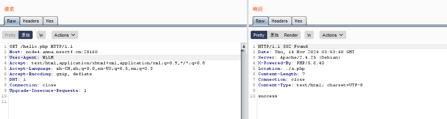
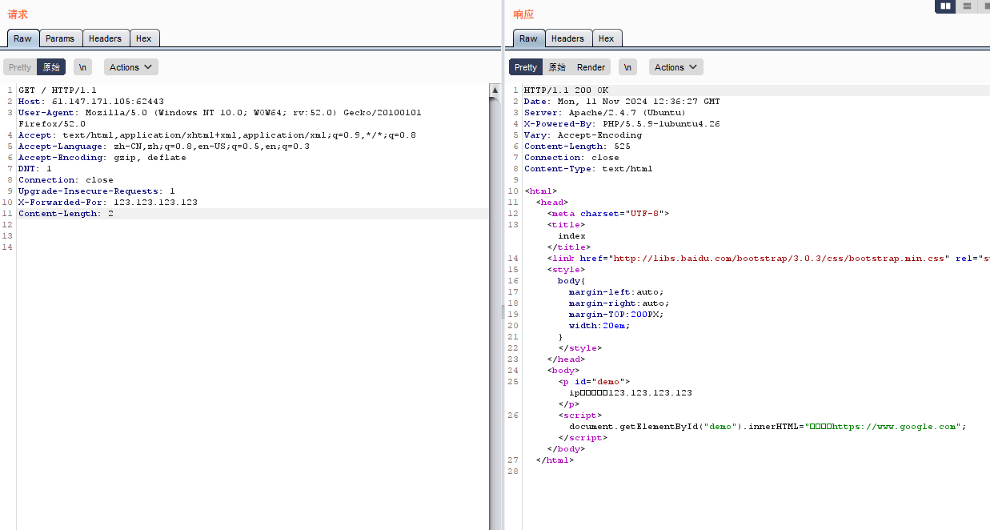

# ua头伪造

要求什么浏览器访问

eg：

请使用WLLM浏览器

bp抓包

修改UA头为：WLLM

# xff伪造

只能本地访问或者指定ip才可以访问

X-Forwarded-For:简称XFF头，它代表客户端，也就是HTTP的请求端真实的IP，只有在通过了HTTP 代理或者负载均衡服务器时才会添加该项

eg：

只能本地访问

bp抓包

添加X-Forwarded-For:127.0.0.1

# client-ip

伪造ip信息

等效于xff

client-ip：127.0.0.1

# cookie

cookie中可能存在某些提示性信息

抓包查看cookies内容

# responed

responed也可能存在某些提示性信息

 

# referer

referer伪造来源（限制来源页）

HTTP Referer是header的一部分，当浏览器向web服务器发送请求的时候，一般会带上Referer，告诉服务器我是从哪个页面链接过来的

eg：只能来自google.com

抓包

添加修改referer

referer:google.com

# via

伪造代理信息

via:Clash.win