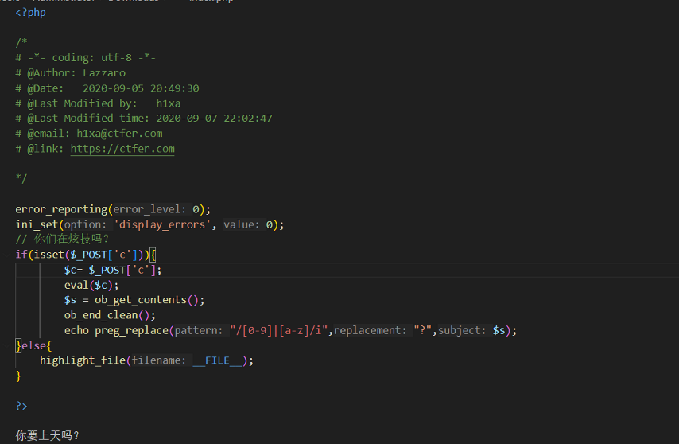
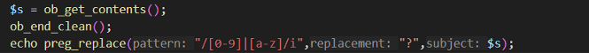
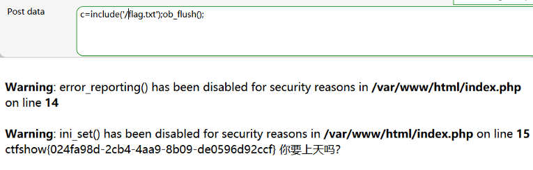
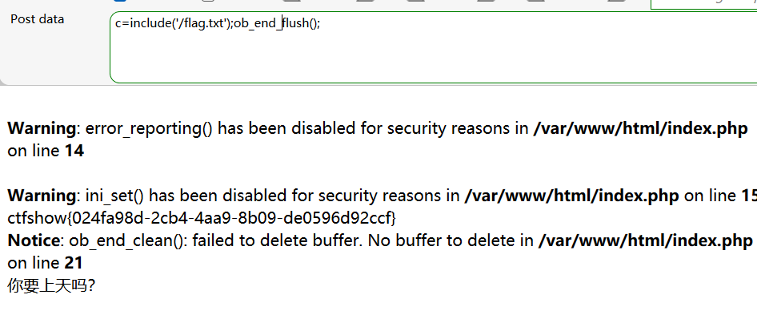

# 相关函数

## ob_get_contents ()

返回输出缓冲区的内容


## ob_end_clean()

清空（擦除）活动缓冲区的内容并关闭它


## ob_flush()

刷新PHP的输出缓冲区，将缓冲区中的内容发送到客户端。

如果缓冲区是嵌套的，那么只会刷新最内层的缓冲区。

调用ob_flush()后，缓冲区的内容会被清空，但缓冲区仍然保持开启状态，可以继续使用


## ob_end_flush()

ob_end_flush()是PHP中的一个输出控制函数，用于刷新输出缓冲区的内容到客户端，并关闭输出缓冲区，它与ob_flush()的区别在于,ob_end_flush()不仅会刷新缓冲区的内容，还会关闭缓冲区。


## exit()

## die()

退出


# 例题



分析源码

post传参c



这一段劫持了输出缓存，并将数字和字母替换为?


可以利用ob_flush();

ob_end_flush()

在劫持输出缓冲区之前就把缓冲区送出






或者在执行完代码后直接退出

exit()

die()

 

```
c=include('/flag.txt');exit();
c=include('/flag.txt');die();
```

