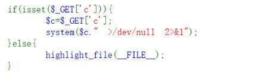

# \>/dev/null 2>&1

意思是将标准输出和标准错误都重定向到/dev/null

# 利用；绕过

 分隔多个命令。所有命令都会依次执行，不论前一个命令是否成功。

# |

只执行管道右侧的命令，并将左侧命令的输出作为输入。

# ||

只有左侧的命令失败时，才执行右侧的命令。

# &

让前面的命令在后台执行。无论该命令的成功与否，后面的命令都会执行。

# &&

只有左侧的命令成功时，才执行右侧的命令。

