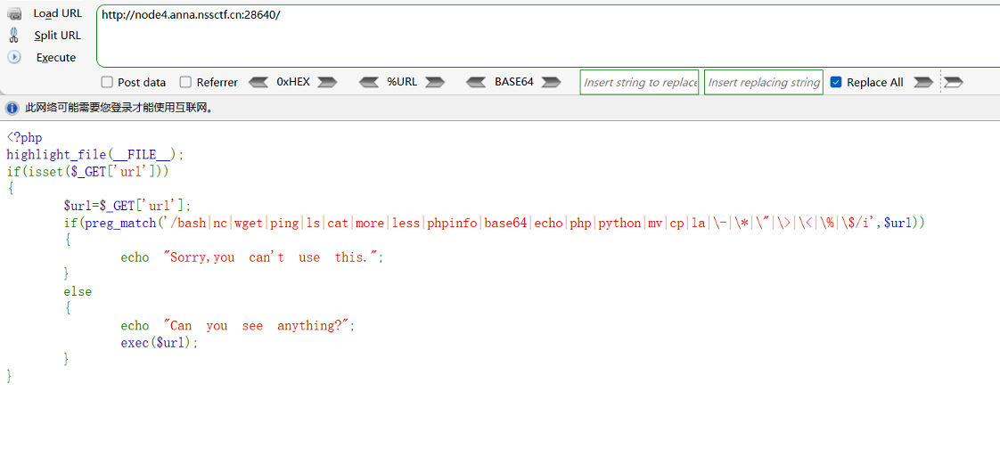
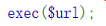
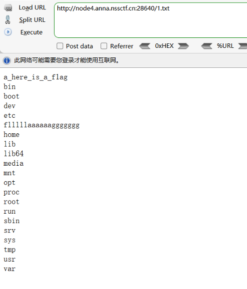
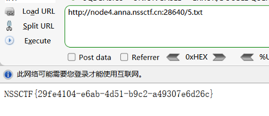

# 例题



分析源码：

get传参url

preg_match过滤

Bash

Nc

Wget

Ping

Ls

Cat

More

Less

Phpinfo

Base64

Echo

Php

Python

Mv

Cp

La

\-

\>

<

%

$



可以执行命令，但是无回显

可以利用tee配合管道符绕过

没有过滤 ' 

可以利用其绕过ls cat 

构造payload

```
?url=l''s / |tee 1.txt
```

接着查看1.txt




读取flllllaaaaaaggggggg

构造payload:

```
?url=tac /flllll''aaaaaaggggggg|tee 5.txt
```


查看5.txt

