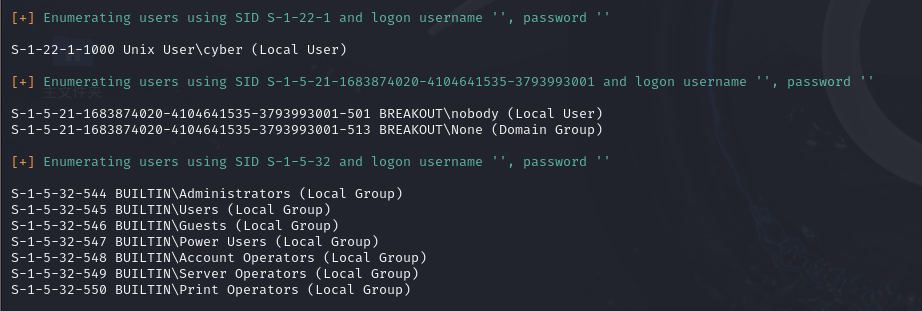

### 介绍

enum4linux 是一个在渗透测试和信息收集中非常有用的工具，专门用于通过 SMB（Server Message Block）协议枚举 Windows 系统上的信息。

它可以帮助你收集关于目标Windows主机的大量信息，如用户列表、共享文件夹、操作系统版本、域信息等。

enum4linux 主要是一个 Linux 下的脚本，通常用来针对 Windows 系统的远程信息收集。




### 基本功能

- 获取 Windows 系统的用户信息（如用户列表、密码策略等）。

- 获取 Windows 系统的共享文件夹和文件信息。

- 获取 Windows 系统的操作系统版本、域名等信息。

- 获取 Windows 系统的组信息和机器信息。


### github项目地址

[GitHub - cddmp/enum4linux-ng：enum4linux（一种 Windows/Samba 枚举工具）的下一代版本，具有 JSON/YAML 导出等附加功能。面向安全专业人士和 CTF 玩家。](https://github.com/cddmp/enum4linux-ng)


### 基本用法


#### 用户枚举

```
enum4linux -u <ip>
```

列出目标系统上的所有用户账户


#### 默认扫描

```
enum4linux -a <ip>
```

-a 选项将运行所有默认扫描项目

包括用户，共享，木马策略，组等的枚举


扫描共享资源

```
enum4linux -S <目标IP>
```

-S 选项会列出目标系统上所有的共享文件夹。


### 扫描用户组信息

```
enum4linux -G <目标IP>
```

-G 选项会列出目标系统的所有用户组


启用详细模式

```
enum4linux -v -a <目标IP>
```

-v   启用详细模式将输出更详细的扫描信息，帮助更好地理解扫描的结果