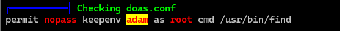

# 介绍

SUID提权是Linux渗透测试中常见的手法，利用系统上所设置了SUID权限的可执行文件实现权限提升。

SUID（Set User ID）允许普通用户以文件拥有者的权限运行程序。例如，如果程序的所有者是root且SUIDD位被设置，即任何权限运行该程序时都会以root权限执行。


# SUID位文件查找

```
find / -uers root -perm -4000 2>/dev/null
```

```
find / -perm -u=s -type f 2>/dev/null
```


# SUID提权原理

如果攻击者发现某个设置了SUID位的文件可以被利用（例如文件所有者是root，且文件内容可控），则可以通过执行该文件获得root


# 命令


## find

```
find . -exec /bin/sh \;
```

分析：

将find命令和-exec操作结合，来查找当前目录下的文件并对每个文件执行/bin/sh

-exec /bin/sh \; 解析：

-exec 是 find 命令的一个选项，用来对每个符合条件的文件执行一个外部命令

/bin/sh 是要执行的命令，这里执行的是系统上默认的shell /bin/sh

\; 用来结束-exec 选项中的命令。由于分号 ； 在shell中是特殊字符，所以需要用反斜杠 \ 来转义它

功能：

从当前目录开始，递归的搜索所有文件和子目录

对每个找到的文件执行/bin/sh

因为find本身拥有SUID权限，意味着它将以文件的所有者（通常为root）身份执行/bin/sh。这时，这个命令的行为就不止是打开一个普通的shell，它将一root权限执行/bin/sh，这就能为用户提供一个具有root权限的交互式shell


### doas

##### 介绍

类似与sudo，其有一个配置文件doas.conf，里面配置了用户可以作为说明用户执行什么命令，如



即允许adam用户作为用户执行find命令

```
doas -u root /usr/bin/find . -exec /bin/sh \;
```


