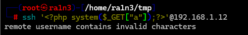
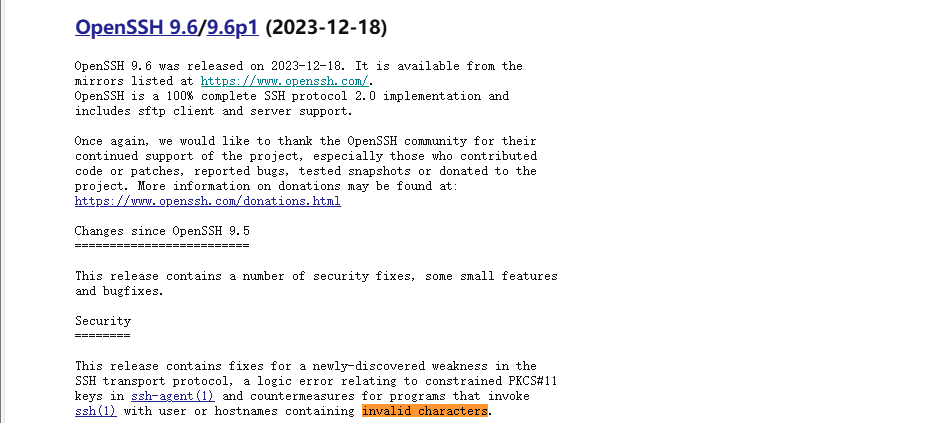
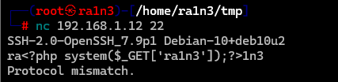
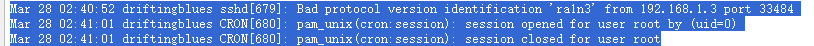
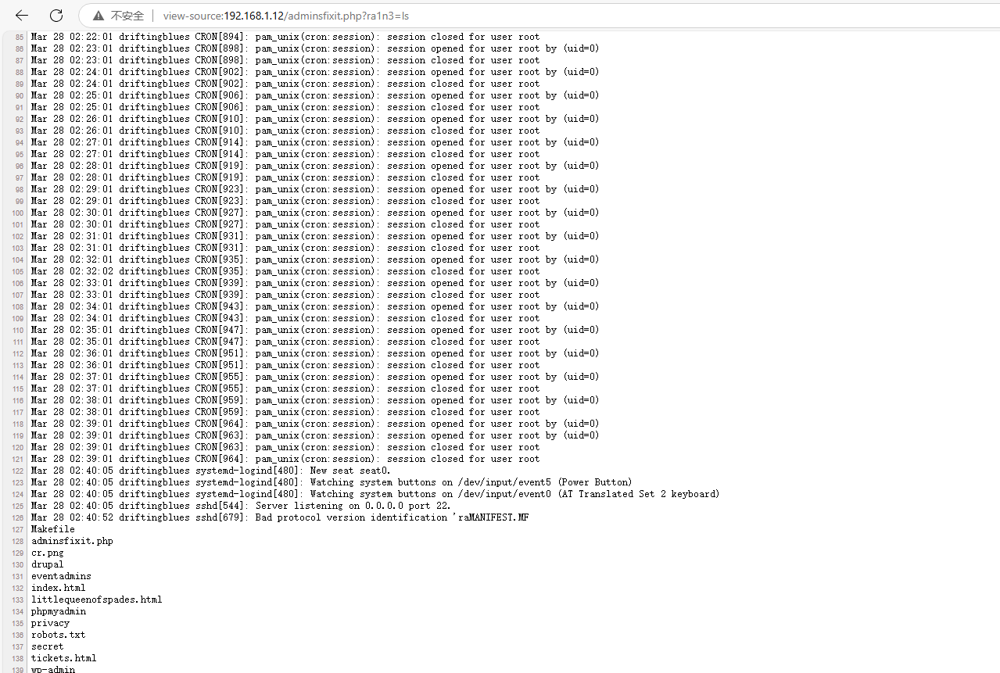
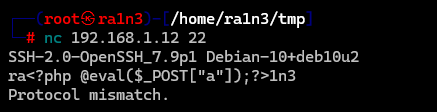
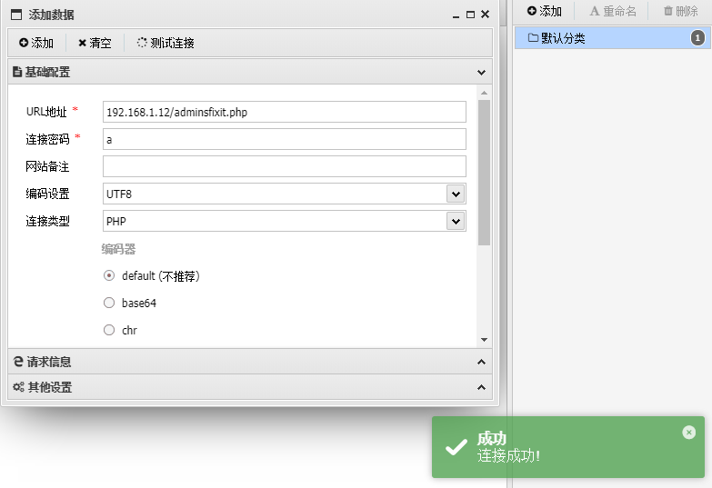

# ssh服务

## 介绍

SSH（Secure Shell，安全壳协议）是一种用于安全远程登录和数据传输的加密网络协议。它广泛应用于Linux、Unix、Windows等操作系统中，用于在不安全的网络环境中安全地访问和管理远程服务器或设备。


## 默认端口

22


## 配置文件

/etc/sshd_config

/etc/ssh_config


## 相关文件

authorized_keys

id_rsa

id_rsa.pub


## ssh连接

```
ssh 用户名@ip
```

可以加入-i参数指定密钥文件（实现免密登录）

加入-p参数指定端口（默认为22）


## 利用ssh上传文件

```
scp <filename> <user>@<ip>:/path/
```


## 关于sshd_config

ssh配置文件

banner默认显示欢迎信息，但是如果改成文件路径，那么登陆时就会返回文件内容，因此可以通过修改Banner信息进行任意文件读取

Include能加载其他配置文件，如果能写入这些文件，就能实现后门写入

如Include /tmp/backdoor

然后再backdoor中写后门


## 关于相关文件权限

SSH 对文件权限很严格，因为它们存敏感信息（私钥、公钥）。权限不对，SSH 就认为不安全，拒绝登录。400 是只读，600 是读写，都只限文件拥有者。

~/.ssh目录默认是700（drwx------）

id_rsa私钥文件，其默认权限为400，即r--------，只有root权限可读，当其权限不为400时，ssh登录将失败

authoirzed_keys文件，默认为600，若权限过宽（如644），SSH会登陆失败（StrictModes启用时）


## 关于免密登录

认证过程：

- 用户将公钥上传到目标服务器的~/.ssh/authorized_keys文件中
- 客户端使用私钥发起连接请求
- 服务器用公钥验证客户端的签名，若匹配则允许登录，无需密码。

```
ssh-copy-id user@target_ip  # 自动把公钥加到服务器
```

因此如果我们能够读取~/.ssh/id_rsa，便可尝试ssh -i id_rsa免密登录


## 关于ssh日志注入

当尝试日志注入时，提示报错，原因可能是ssh9.6以上的版本本地进行了用户名校验

```
ssh '<?php system($_GET["a"]);?>'@192.168.1.12
```





可以选择ssh版本降级

或是更简单的方法：使用nc





成功写入日志



且能成功执行命令







## 关于公钥劫持

通过修改sshd_config文件相应配置信息实现公钥劫持

首先生成密钥，并将公钥保存到目标服务器

检测配置文件 /etc/ssh/sshd_config，查看PermitRootLogin的状态

```
PermitRootLogin yes  # 运行root用户通过SSH登录
StrictModes no  # 禁用权限严格检查，避免因权限问题阻止SSH登录 
AuthorizedKeysFile  /home/ssh/.ssh/id_rsa.pub  # 指定使用自定义的公钥文件
```

重启ssh服务便可实现免密登录

如果目标用户的authorized_keys文件可写，也可以直接将自己的公钥写入

同时可以尝试加入定时任务，echo公钥内容>> authorized_keys


关于登录报错

https://blog.csdn.net/weilaozongge/article/details/141926639


