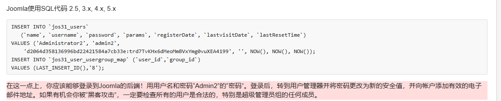
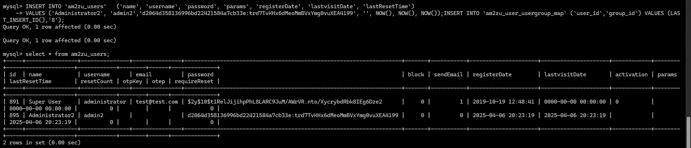
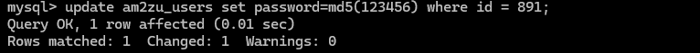

# 参考链接

```
https://docs.joomla.org/How_do_you_recover_or_reset_your_admin_password%3F/zh-cn
```


## 第一种方法：



```
INSERT INTO `am2zu_users`   (`name`, `username`, `password`, `params`, `registerDate`, `lastvisitDate`, `lastResetTime`)
VALUES ('Administrator2', 'admin2','d2064d358136996bd22421584a7cb33e:trd7TvKHx6dMeoMmBVxYmg0vuXEA4199', '', NOW(), NOW(), NOW());INSERT INTO `am2zu_user_usergroup_map` (`user_id`,`group_id`) VALUES (LAST_INSERT_ID(),'8');
```



然后利用admin2：secret登录


## 第二种方法：

手动修改密码，md5加密即可

```
update am2zu_users set password=md5(123456) where id = 891;
```



利用administrator：123456登录后台


## 相关打法

模板注入

常见Beez3模板

```
/templates/beez3/
```

如error.php

```
/templates/beez3/error.php
```

