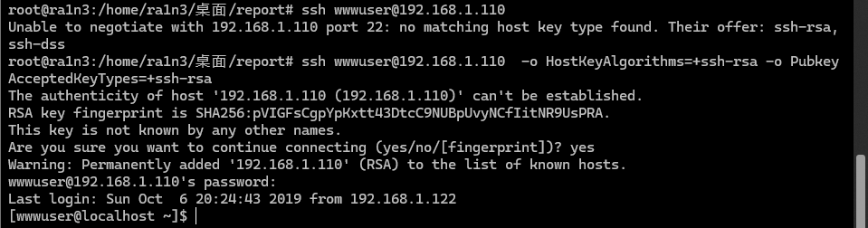

[ssh登录服务器报错“no matching host key type found. Their offer: ssh-rsa,ssh-dss”解决方法-CSDN博客](https://blog.csdn.net/weilaozongge/article/details/141926639)


这个错误表明你尝试使用 `ssh` 连接到远程服务器时，客户端和服务器之间没有匹配的 host key 类型。具体来说，远程服务器提供了 `ssh-rsa` 和 `ssh-dss` 类型的 host key，但你的SSH 客户端配置可能不再支持这些较旧的算法。最近的 OpenSSH 版本默认禁用了不够安全的算法，如 `ssh-rsa` 和 `ssh-dss`。

```
-o HostKeyAlgorithms=+ssh-rsa -o PubkeyAcceptedKeyTypes=+ssh-rsa
```

