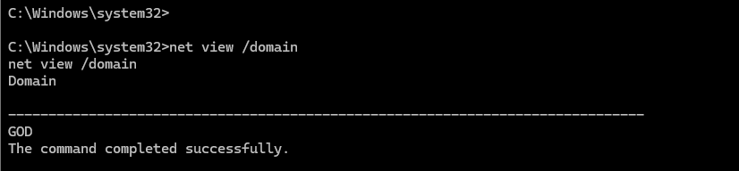
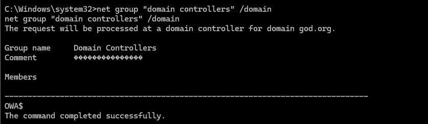
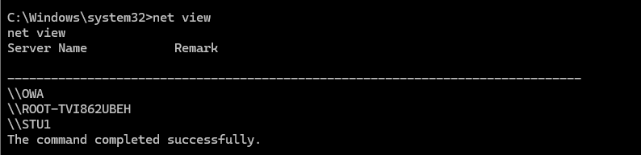
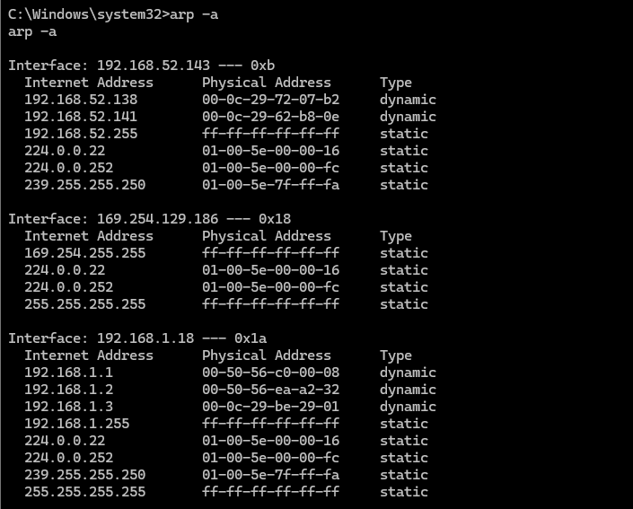
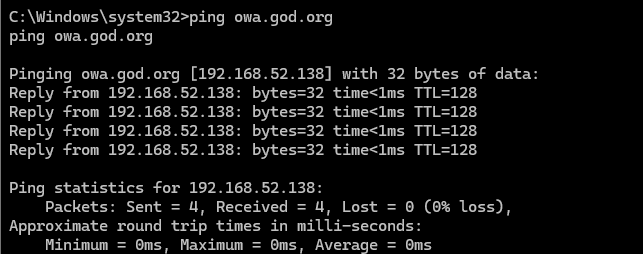

```
收集域内信息
内网信息收集的主要目的就是查找域控以及域控内的其他主机

net view                 # 查看局域网内其他主机名
net config Workstation   # 查看计算机名、全名、用户名、系统版本、工作站、域、登录域
net user                 # 查看本机用户列表
net user /domain         # 查看域用户
net localgroup administrators # 查看本地管理员组（通常会有域用户）
net view /domain         # 查看有几个域
net user 用户名 /domain   # 获取指定域用户的信息
net group /domain        # 查看域里面的工作组，查看把用户分了多少组（只能在域控上操作）
net group 组名 /domain    # 查看域中某工作组
net group "domain admins" /domain  # 查看域管理员的名字
net group "domain computers" /domain  # 查看域中的其他主机名
net group "domain controllers" /domain  # 查看域控制器主机名（可能有多台）
```


查看 有几个域

```
net view domain
```




查看域控主机名

```
net group "domain controllers" /domain
```




查询域内主机

```
net view
```




查询域内主机ip

```
arp -a
```




可以利用ping命令得到域控主机ip

```
ping owa.god.org
```


