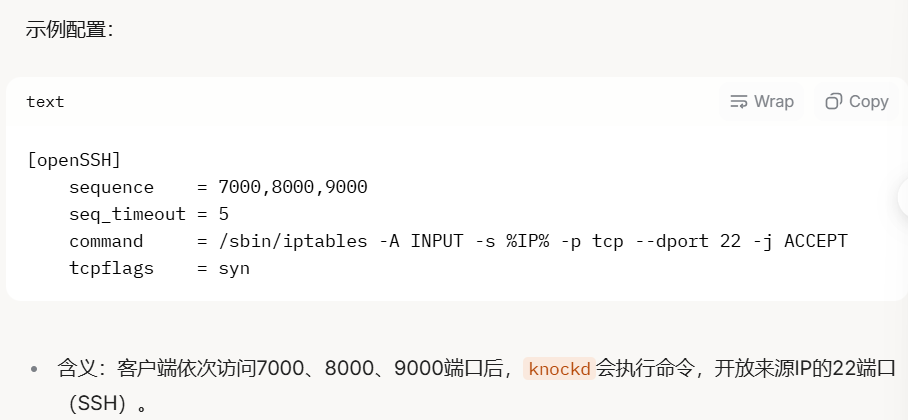

# filtered

在端口扫描（如使用 nmap）时，如果目标端口返回“filtered”，意味着扫描工具无法明确判断该端口是开放（open）、关闭（closed）还是其他状态。

# 原因

- 数据包被防火墙、网络过滤设备（如IDS/IPS）拦截或丢弃。
  - 检测方法：尝试其他扫描技术（如 -sA ACK扫描）或从不同源IP测试。
- 没有收到任何响应（可能是丢包或被丢弃）。
- 目标主机未返回RST（关闭端口的标志）或SYN-ACK（开放端口的标志）。
- 敲门服务（Port Knocking）
  - 一种安全机制，通过特定的端口敲门序列（例如依次访问端口1000、2000、3000）来临时开放目标端口（如22）

 filter通常意味着目标主机的22端口被防火墙或其他网络过滤设备屏蔽了，也就是说扫描工具无法确定这个端口是开放还是关闭，因为相应被拦截或丢弃了

 

当22端口为过滤状态，无法进行暴力破解

（可能配置了knock服务）

/etc/knockd.conf是knockd服务的配置文件，knockd是一个端口敲门（port knocking）工具，用于增强服务器安全性，它通过监听特定的端口敲门序列（例如按顺序访问某些端口）来动态开放防火墙规则，允许后续连接（如SSH）

 

文件通常定义敲门规则，如：

序列：敲门的端口顺序

超时：敲门有效时间

命令：敲门成功后执行的操作（如开放SSH端口）

默认情况下，/etc/knockd.conf全局可读，但是只有root可写

如果目标服务器运行了knockd，这个文件可能存在

读取/etc/knockd.conf可以暴露敲门序列，从而绕过端口屏蔽

如 22端口的filtered，直接访问隐藏服务
