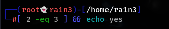
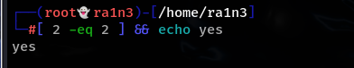
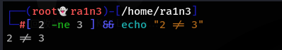
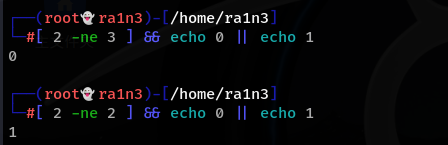
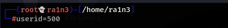
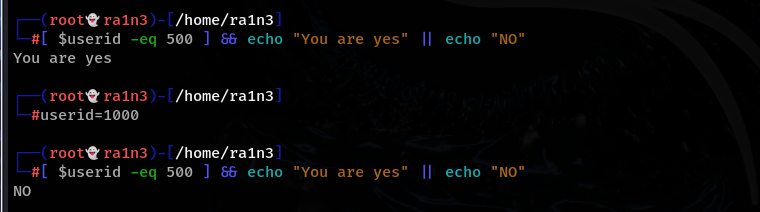

中括号两边必须要有空格

 

 

相等 -eq

解释：

eq判断2和3是否相等，如果满足条件就执行&&后的语句

 

输出后无回显，因为2和3不相等，所以不执行echo yes

不等 -ne

判断条件成功则执行&&后的语句

||和&&是相对的

||表示它前面的命令执行失败则执行||

即先判断2不等于3 结果为真，执行&&，回显0

 

判断2不等于2 结果为假，执行||，回显1

大于 -gt

小于 -lt

大于等于 -ge

 

 

小于等于 -le

