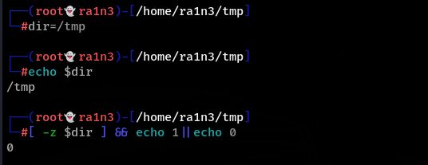
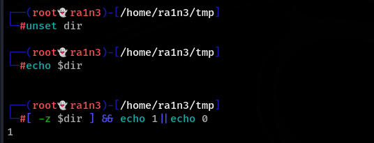
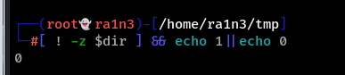
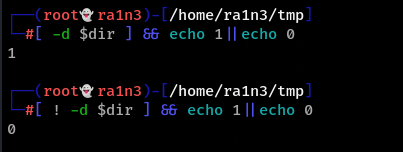
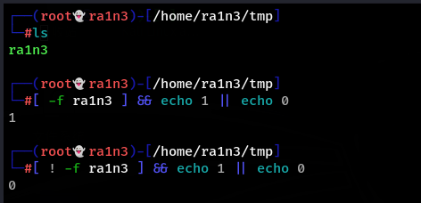
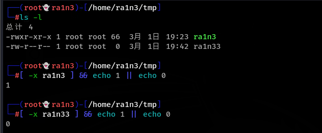

建议：

所有的字符串和变量都加双引号

 

 

-z 判断字符串是不是空值

检测dir变量是否为空，为空则输出1，不为空则输出0

! 非

即判断dir变量是不是非空，是则输出1，不是则输出0

 

 

 

 

-d 判断路径是否存在

判断路径是否存在，存在则输出1，不存在则输出0

 

判断路径是否不存在，不存在则输出1，存在则输出0

 

 

 

-f 判断文件是否存在

判断ra1n3文件是否存在，存在则输出1，不存在则输出0

判断ra1n3文件是否不存在，不存在则输出1，存在则输出0

 

 

 

-x 判断是否有执行权限

