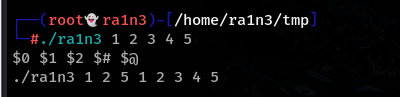
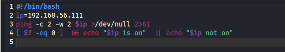
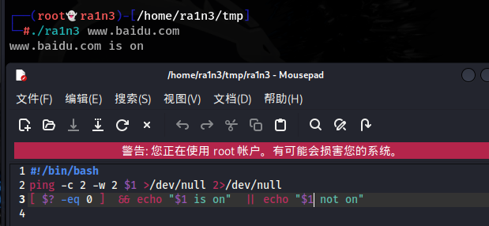
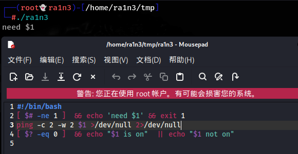
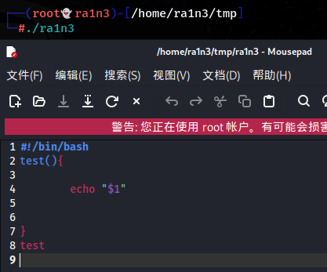
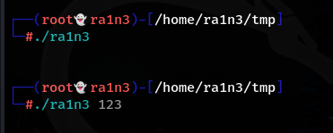
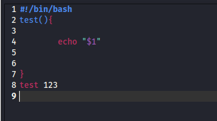
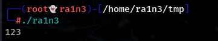

$0 表示脚本的名字

 

$1 表示脚本第一个变量的名字

 

$2 表示脚本第二个变量的名字

 

$# 表示脚本共有几个位置变量

 

$@ 所有参数

$0 在这里为 ./ra1n3，表示当前执行的脚本

$1 在这里为 1，表示第一个位置参数

$2 在这里为 2 ，表示第二个位置参数

$# 在这里为 5 ，表示共有五个参数

$@ 在这里表示 1 2 3 4 5，表示所有参数的值

 

 

 

 

测试ping ip的简单脚本

ping命令参数

-c表示发送的请求包数量，不定义就会一直发送，一般为2或4

-w 超时时间

 

\>/dev/null

标准输出重定向

2>&1

标准错误输出重定向

即无输出 

也可以写为2>/dev/null

 

$? 表示上一条命令是否执行成功，成功为0，没成功为非0

-eq 判断是否相等

如果结果为true就执行&&后的语句

如果为false就执行||后的语句

 

用位置变量接收$IP参数

$1表示第一个位置变量，即ping用户传入的第一个参数，如果执行成功则返回该ip+is on

 

 

 

 

利用$#位置变量判断用户传参是否正确

$#判断用户传入的参数个数，如果参数数量不等于1，则输出需要第一个位置参数，并退出脚本

&& 1 && 2

表示既执行1又执行2

exit 1 表示退出脚本

1可以为任意非零值，默认都为1

exit 0 表示正常退出

定义一个函数test，并在函数内部执行echo $1

此时我们直接调用，传不传第一个位置参数都是无回显

 

因为定义在函数中的位置参数表示传给这个函数的参数

而给函数传参的做法是：直接在函数调用出跟参数值